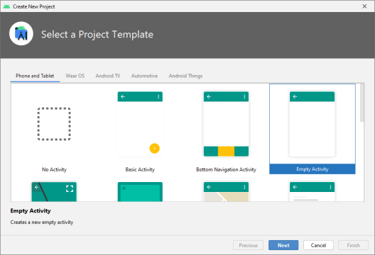
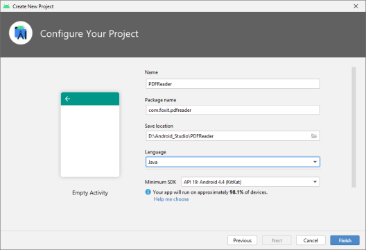
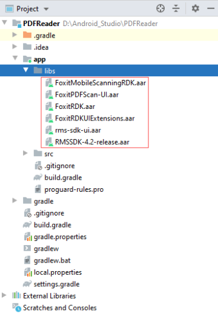
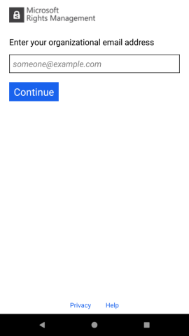
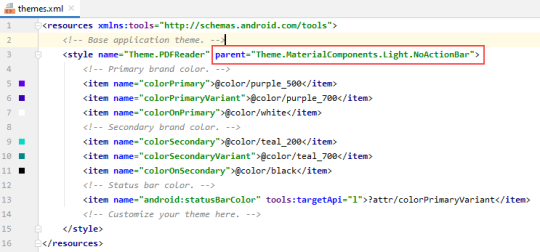
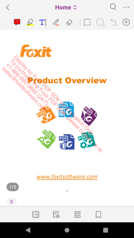

# 快速构建一个功能齐全的PDF阅读器

Foxit PDF SDK for Android 将所有的UI实现（包括应用程序的基本UI和即用型UI功能模块）封装在UI
Extensions组件中，因此开发人员可以轻松快速通过几行代码构建一个功能齐全的PDF阅读器。

本章将提供详细的教程来帮助您快速开始使用Foxit PDF SDK for Android在Android平台创建一个功能齐全的PDF阅读器。其主要包括以下的步骤：

- 创建一个新的Android工程
- 集成Foxit PDF SDK for Android到您的应用程序
- 初始化Foxit PDF SDK for Android
- 使用PDFViewCtrl显示PDF文档
- 打开一个RMS加密的文档
- 使用UI Extensions组件构建一个功能齐全的PDF阅读器
- 基于功能齐全的PDF阅读器添加扫描功能

## 创建一个新的Android工程

在本指南中，使用Android Studio 4.1.2，以及Android API 30.

打开Android Studio，选择 File - > New - > New Project ...，在 Select a Project Template 向导中，选择 "Empty Activity"
，如下图所示。然后点击 Next 。



然后填写 Configure your project 对话框，如下图所示。填写完后，点击 Finish 。



## 集成Foxit PDF SDK for Android到您的应用程序

::: warning
在本章中，我们将使用默认的内置UI实现来开发该应用程序，为了简单和方便 (直接使用UI
Extensions组件，不需要源代码工程)，我们只需要添加以下的文件到PDFReader工程中。

- FoxitRDK.aar ： 包含JAR包，其中包括Foxit PDF SDK for Android的所有Java APIs，以及
  ".so"库。".so"库是SDK的核心包含了Foxit PDF SDK for Android的核心函数。它针对每种
  架构单独编译，当前支持armeabi-v7a, arm64-v8a, x86, 和 x86_64架构。
- FoxitRDKUIExtensions.aar ： 由"libs"目录下的 " uiextensions_src "工程 编译生成。包括
  JAR包，内置UI实现，以及UI所需要的资源文件，如图片，字符串、颜色值、布局文件以及
  其他Android UI资源。

:::

::: tip
在接下来的 "初始化Foxit PDF SDK for Android"，"使用PDFViewCtrl显示PDF文档" 以及 "打开一个RMS加密的文档"三小节中，不需要使用UI
Extensions组件 (FoxitRDKUIExtensions.aar),因此您可以先将 FoxitRDK.aar 添加到工程中。然后在您需要使用UI
Extensions组件时再添加FoxitRDKUIExtensions.aar ，比如在 "使用UI Extensions组件构建一个功能齐全的PDF阅读器"章节中。
:::

添加上述的两个AAR文件到PDFReader工程，请切换到"Project"面板，然后按照如下的步骤：

1. 从下载包的"libs"文件夹下拷贝" FoxitRDK.aar " 和 " FoxitRDKUIExtensions.aar "文件到"PDFReader\app\libs"文件夹下。

   ::: warning

    - 如果需要支持微软RMS，您需要同时拷贝 " RMSSDK-4.2-release.aar " 和 " rms-sdk-ui.aar " 文件。
    - 如果需要支持scanning功能，您需要同时拷贝 " FoxitMobileScanningRDK.aar "和" FoxitPDFScan-UI.aar " 文件。

   :::

   同步PDFReader工程，然后该工程将如下图所示。

   

2. 将"libs"目录定义为repository。在app下面的build.gradle文件中，添加如下的配置：

    ``` groovy
        repositories {
            flatDir {
            dirs 'libs'
          }
        }

    ```

3. 启用Multi-Dex。在app下面的build.gradle文件中，添加如下的代码：

    ``` groovy
        ...
        android {
         compileSdkVersion 30
         buildToolsVersion "30.0.3"
         defaultConfig {
            applicationId "com.foxit.pdfreader"
            minSdkVersion 19
            targetSdkVersion 30
            versionCode 1
            versionName "1.0"
            testInstrumentationRunner "androidx.test.runner.AndroidJUnitRunner"
            multiDexEnabled true
          }
         ...
         }
         ...
         dependencies {
           implementation 'androidx.multidex:multidex:2.0.1'
           implementation 'androidx.appcompat:appcompat:1.2.0'
           implementation 'com.google.android.material:material:1.3.0'
           implementation 'androidx.constraintlayout:constraintlayout:2.0.4'
         }
         ...
    ```

4. 将Foxit PDF SDK for Android作为工程的依赖项。在app下面的 "build.gradle" 文件中，添加" FoxitRDK.aar ", "
   FoxitRDKUIExtensions.aar " 以及相关支持的库到dependencies。为简单起见，如下所示更新dependencies：
   ``` groovy
   dependencies {
   implementation 'androidx.multidex:multidex:2.0.1'
   implementation 'androidx.appcompat:appcompat:1.3.0'
   implementation 'com.google.android.material:material:1.3.0'
   implementation 'androidx.constraintlayout:constraintlayout:2.0.4'
   implementation(name: 'FoxitRDK', ext: 'aar')
   implementation(name: 'FoxitRDKUIExtensions', ext: 'aar')
   implementation 'com.edmodo:cropper:1.0.1'
   // RMS
   implementation 'com.microsoft.identity.client:msal:2.+'
   implementation(name: 'RMSSDK-4.2-release', ext: 'aar')
   implementation(name: 'rms-sdk-ui', ext: 'aar')
   // Scanning
   implementation(name: 'FoxitPDFScan-UI', ext: 'aar')
   implementation(name: 'FoxitMobileScanningRDK', ext: 'aar')
   implementation 'com.nostra13.universalimageloader:universal-image-loader:1.9.5'
   // RxJava: Compare
   implementation "io.reactivex.rxjava2:rxjava:2.2.16"
   implementation 'io.reactivex.rxjava2:rxandroid:2.1.1'
   // Signature
   implementation 'org.bouncycastle:bcpkix-jdk15on:1.64'
   implementation 'org.bouncycastle:bcprov-jdk15on:1.64'
   }
   ```
   ::: warning
    - (必选) Foxit PDF SDK for Android依赖于 com.google.android.material ，如果dependencies中没有该依赖项，则需要添加如下的条目：
   ``` groovy
   implementation 'com.google.android.material:material:1.1.0'
   ```

    - (可选) 如果您需要使用截图 (Snapshot)功能 (如在Complete PDF viewer demo，在右上方点击 ，可以看到Screen
      Capture功能选项) ，您需要添加如下的条目到dependencies中：
      ``` groovy
      implementation 'com.edmodo:cropper:1.0.1'
      ```
    - (可选) 如果您需要打开RMS加密的PDF文档，您需要添加如下的条目到dependencies中。
      ``` groovy
      implementation 'com.microsoft.identity.client:msal:2.+'
      implementation(name: 'RMSSDK-4.2-release' , ext: 'aar' )
      implementation(name: 'rms-sdk-ui' , ext: 'aar' )
      ```
      ::: warning
      您最好使用RMS SDK 4.2 和 MSAL 2+版本，否则可能会导致兼容性问题。其次 ，您需要在工程级的 "build.gradle"
      文件中的repositories部分添加如下的配置：

      ``` groovy
          allprojects {
            repositories {
              google()
              jcenter()
              maven {
                url 'https://pkgs.dev.azure.com/MicrosoftDeviceSDK/DuoSDK-Public/_packaging/Duo-SDK-Feed/maven/v1'
              }
            }
          }
      ```

      有关更详细的说明，请参阅 [https://github.com/AzureAD/microsoft-authentication-library-for-android](https://github.com/AzureAD/microsoft-authentication-library-for-android)。
    - (可选) 如果您需要使用扫描 (scanning) 功能 (比如，在Complete PDF viewer
      demo的启动页面，可以看到扫描功能按钮选项)
      ，则需要添加如下的条目到dependencies中。
      ``` groovy
      implementation(name: 'FoxitMobileScanningRDK' , ext: 'aar' )
      implementation(name: 'FoxitPDFScan-UI' , ext: 'aar' )
      implementation 'com.nostra13.universalimageloader:universal-image-loader:1.9.5'
      ```

    - (可选) 如果您需要使用对比功能 (比如，在Complete PDF viewer
      demo的启动页面，点击右上方的
      ，可以看到对比功能选项)
      ，则需要添加如下的条目到dependencies中。
      ``` groovy
      implementation "io.reactivex.rxjava2:rxjava:2.2.16"
      implementation 'io.reactivex.rxjava2:rxandroid:2.1.1'
      ```
    - (可选) 如果您需要使用签名功能，则需要添加如下的条目到dependencies中。
      ``` groovy
      implementation 'org.bouncycastle:bcpkix-jdk15on:1.64'
      implementation 'org.bouncycastle:bcprov-jdk15on:1.64'
      ```
   此处，我们将如上所有的支持库都添加到dependencies中，因为稍后我们将构建一个功能齐全的PDF阅读器，该阅读器包含Foxit PDF SDK
   for Android所提供的所有的功能。在APP下的"build.gradle"中设置完成后，同步工程，然后您可以在 External Libraries 下看到"
   FoxitRDK.aar ", " FoxitRDKUIExtensions.aar ", " FoxitMobileScanningRDK.aar "," FoxitPDFScan-UI.aar ", "
   universal-image-loader ", " material ", " cropper ", " rxjava "," rxandroid " , " bcpkix-jdk15on ", "
   bcprov-jdk15on " 和 RMS 相关的包。
   :::

App下的 "build.gradle" 的完整代码如下。

``` groovy
plugins {
    id 'com.android.application'
}

android {
    compileSdkVersion30
    buildToolsVersion"30.0.3"

    defaultConfig {
        applicationId "com.foxit.pdfreader"
        minSdkVersion 19
        targetSdkVersion  30
        versionCode 1
        versionName "1.0"
        testInstrumentationRunner "androidx.test.runner.AndroidJUnitRunner"
        multiDexEnabled true
    }
    buildTypes {
        release {
            minifyEnabled false
            proguardFiles getDefaultProguardFile('proguard-android.txt'), 'proguard-rules.pro'
        }
    }
    compileOptions {
        sourceCompatibility JavaVersion.VERSION_1_8
        targetCompatibility JavaVersion.VERSION_1_8
    }

}

repositories {
    flatDir {
        dirs 'libs'
    }
}

dependencies {
    implementation 'androidx.appcompat:appcompat:1.6.1'
    implementation "androidx.multidex:multidex:2.0.1"
    //  UI Extensions 使用了material来封装UI，如果使用UI Extensions一定要添加
    implementation 'com.google.android.material:material:1.8.0'
    //  Foxit PDF Core API 及 PDF View Control
    implementation(name: 'FoxitRDK', ext: 'aar')
    //  UI Extensions组件
    implementation(name: 'FoxitRDKUIExtensions', ext: 'aar')
    //  (可选)如果您需要使用截图功能
    implementation 'com.edmodo:cropper:1.0.1'
    //  (可选)如果您需要打开RMS加密的PDF文档
    implementation(name: 'RMSSDK-4.2-release', ext: 'aar')
    implementation(name: 'rms-sdk-ui', ext: 'aar')
    implementation 'com.microsoft.identity.client:msal:3.0.+'
    //  (可选)如果您需要使用扫描功能
    implementation(name: 'FoxitPDFScan-UI', ext: 'aar')
    implementation(name: 'FoxitMobileScanningRDK', ext: 'aar')
    implementation 'com.nostra13.universalimageloader:universal-image-loader:1.9.5'
    //  (可选)如果您需要使用对比功能
    implementation "io.reactivex.rxjava2:rxjava:2.2.16"
    implementation 'io.reactivex.rxjava2:rxandroid:2.1.1'
    //  (可选)如果您需要使用签名功能
    implementation 'org.bouncycastle:bcpkix-jdk15on:1.60'
    implementation 'org.bouncycastle:bcprov-jdk15on:1.60'
}
```

::: warning
使用AndroidX，compileSdkVersion最低需要设置成 28 。在本工程中，我们将compileSdkVersion 和 targetSdkVersion设置为API
30。如果您也使用API 30，请确保您已经安装了Android 11.0，API 30 SDK平台。如果没有，请首先打开Android SDK Manager进行下载和安装。
:::

## 初始化Foxit PDF SDK for Android

在调用任何API之前，应用程序必须使用license初始化Foxit PDF SDK for Android。Library.initialize (sn, key)
函数用于SDK库的初始化。试用license文件在下载包的"libs"
文件夹下。当试用期结束后，您需要购买正式license以继续使用该SDK。下面是SDK库初始化的示例代码。在下一节中将介绍该代码在PDFReader工程中的位置。

```java
import com.foxit.sdk.common.Library;
import com.foxit.sdk.common.Constants;

int errorCode = Library.initialize(sn, key);
if (errorCode != Constants.e_ErrSuccess) {
  return;
```

::: warning
sn的值在"rdk_sn.txt"中("SN="后面的字符串)，key的值在"rdk_key.txt"中("Sign="后面的字符串)。
:::

## 使用PDFViewCtrl显示PDF文档

到目前为止，我们已经在PDFReader工程中添加了Foxit PDF SDK for Android库，并且完成了SDK库的初始化。现在，我们将使用PDFViewCtrl通过几行代码来显示一个PDF文档。

::: warning
如果只需要显示一个PDF文档，则不需要UI Extensions组件。
:::

显示一个PDF文档，请按照如下的步骤：

1. 实例化一个PDFViewCtrl对象来显示一个PDF文档。

   在MainActivity.java中，实例化一个PDFViewCtrl对象，调用 PDFViewCtrl.openDoc 函数打开和渲染PDF文档。

   ``` java
   import com.foxit.sdk.PDFViewCtrl;
   ...
   private PDFViewCtrl pdfViewCtrl = null;
   ...
   pdfViewCtrl = new PDFViewCtrl(this);
   String path = "/mnt/sdcard/input_files/Sample.pdf";
   pdfViewCtrl.openDoc(path,null);
   setContentView(pdfViewCtrl);
   ```

   ::: warning
   请确保您已经将 "Sample.pdf"文档添加到用于运行该工程的Android设备或者模拟器中已创建的 "input_files"文件夹。
   :::

   更新 MainActivity.java：
   ``` java
   package com.foxit.pdfreader;
   
   import android.os.Bundle;
   import androidx.appcompat.app.AppCompatActivity;
   
   import com.foxit.sdk.PDFViewCtrl;
   import com.foxit.sdk.common.Constants;
   import com.foxit.sdk.common.Library;
   
   public class MainActivity extends AppCompatActivity {
   
      private PDFViewCtrl pdfViewCtrl = null ;
   
      // The value of "sn" can be found in the "rdk_sn.txt".
      // The value of "key" can be found in the "rdk_key.txt".
      private static String sn = " " ;
      private static String key = " " ;
   
      @Override
      protected void onCreate(Bundle savedInstanceState) {
         super.onCreate(savedInstanceState);
         // initialize the library.
         int errorCode = Library.initialize(sn,key);
         if (errorCode != Constants.e_ErrSuccess )
            return ;
         pdfViewCtrl = new PDFViewCtrl(this);
         String path = "/mnt/sdcard/input_files/Sample.pdf" ;
         pdfViewCtrl .openDoc(path,null);
   
         setContentView(pdfViewCtrl);
      }
   }
   ```
2. 设置Android设备或者模拟器的SD卡的读写权限。您需要添加额外的代码申请授权运行时权限。

   在 MainActivity.java 中，添加如下的代码：
   ``` java
   import android.Manifest;
   import android.content.pm.PackageManager;
   import android.os.Build;

   import androidx.core.app.ActivityCompat;
   import androidx.core.content.ContextCompat;
   import androidx.annotation.NonNull;
   ...

   private static final int REQUEST_EXTERNAL_STORAGE = 1;
   private static final String[] PERMISSIONS_STORAGE = {
       Manifest.permission. READ_EXTERNAL_STORAGE,
       Manifest.permission. WRITE_EXTERNAL_STORAGE
   };
   ...
   
   // Require the authorization of runtime permissions.
   if (Build.VERSION.SDK_INT >= 23){
      int permission = ContextCompat.checkSelfPermission(this.getApplicationContext(),Manifest.permission.WRITE_EXTERNAL_STORAGE);
      if (permission != PackageManager.PERMISSION_GRANTED ){
       ActivityCompat.requestPermissions(this,PERMISSIONS_STORAGE,REQUEST_EXTERNAL_STORAGE);
       return ;
      }
   }
   ...
   
   @Override
   public void onRequestPermissionsResult(int requestCode,@NonNull String[] permissions,@NonNull int[] grantResults) {
       if (requestCode == REQUEST_EXTERNAL_STORAGE && grantResults[0] == PackageManager.PERMISSION_GRANTED){
           // Open and Reader a PDF document.
           String path = "/mnt/sdcard/input_files/Sample.pdf" ;
           pdfViewCtrl .openDoc(path, null );
           setContentView( pdfViewCtrl );
       }else{
           super.onRequestPermissionsResult(requestCode,permissions,grantResults);
       }
   }
   ```
   然后， MainActivity.java 的全部代码如下所示：
   ``` java
   package com.foxit.pdfreader;

   import android.Manifest;
   import android.content.pm.PackageManager;
   import android.os.Build;
   import android.os.Bundle;

   import androidx.appcompat.app.AppCompatActivity;
   import androidx.core.app.ActivityCompat;
   import androidx.core.content.ContextCompat;
   import androidx.annotation.NonNull;

   import com.foxit.sdk.PDFViewCtrl;
   import com.foxit.sdk.common.Constants;
   import com.foxit.sdk.common.Library;


   public class MainActivity extends AppCompatActivity{
   
     private PDFViewCtrl pdfViewCtrl = null;

     private static final int REQUEST_EXTERNAL_STORAGE = 1;
     private static final String[] PERMISSIONS_STORAGE = {
         Manifest.permission. READ_EXTERNAL_STORAGE,
         Manifest.permission. WRITE_EXTERNAL_STORAGE
     };
     // The value of "sn" can be found in the "rdk_sn.txt".
     // The value of "key" can be found in the "rdk_key.txt".
     private static String sn = "";
     private static String key = "";
   
     @Override
     protected void onCreate(Bundle savedInstanceState) {
       super.onCreate(savedInstanceState);

       // Initialize the library.
       int errorCode = Library.initialize(sn,key);
       if (errorCode != Constants.e_ErrSuccess)
         return;

       // Instantiate a PDFViewCtrl object.
       pdfViewCtrl = new PDFViewCtrl(this);

       // Require the authorization of runtime permissions.
       if (Build.VERSION. SDK_INT >= 23 ){
          int permission = ContextCompat.checkSelfPermission(this.getApplicationContext(),Manifest.permission.WRITE_EXTERNAL_STORAGE);
          if (permission != PackageManager.PERMISSION_GRANTED) {
             ActivityCompat.requestPermissions(this,PERMISSIONS_STORAGE,REQUEST_EXTERNAL_STORAGE);
             return;
          }
       }
     
       // Open and Render a PDF document.
       String path = "/mnt/sdcard/input_files/Sample.pdf" ;
       pdfViewCtrl.openDoc(path,null);
       setContentView(pdfViewCtrl);
     }

     @Override
     public void onRequestPermissionsResult(int requestCode,@NonNull String[] permissions,@NonNull int[] grantResults) {
       if (requestCode == REQUEST_EXTERNAL_STORAGE && grantResults[0] == PackageManager.PERMISSION_GRANTED){
         // Open and Reader a PDF document.
         String path = "/mnt/sdcard/input_files/Sample.pdf";
         pdfViewCtrl.openDoc(path,null);
         setContentView(pdfViewCtrl);
       }else{
         super.onRequestPermissionsResult(requestCode,permissions,grantResults);
       }
     }

     @Override
     public void onRequestPermissionsResult(int requestCode,@NonNull String[] permissions,@NonNull int[] grantResults) {
       if (requestCode == REQUEST_EXTERNAL_STORAGE && grantResults[ 0 ] == PackageManager.PERMISSION_GRANTED ) {
         // Open and Render a PDF document.
         String path = "/mnt/sdcard/input_files/Sample.pdf";
         pdfViewCtrl.openDoc(path,null);
         setContentView(pdfViewCtrl);
       }else{
         super.onRequestPermissionsResult(requestCode,permissions,grantResults);
       }
     }
   }
   ```
3. 更新 "PDFReader\app\src\main" 目录下的AndroidManifest.xml 文件，如下所示：
   ```xml
   <?xml version="1.0" encoding="utf-8"?>
   <manifest xmlns:android="http://schemas.android.com/apk/res/android"
     xmlns:tools="http://schemas.android.com/tools"
     package="com.foxit.pdfreader">
   
     <application
       android:allowBackup="true"
       android:icon="@mipmap/ic_launcher"
       android:label="@string/app_name"
       android:roundIcon="@mipmap/ic_launcher_round"
       android:supportsRtl="true"
       android:requestLegacyExternalStorage="true"
       tools:replace="android:theme"
       android:theme="@style/Theme.PDFReader">
   
       <activity android:name=".MainActivity">
         <intent-filter>
           <action android:name="android.intent.action.MAIN"/>
           <category android:name="android.intent.category.LAUNCHER"/>
         </intent-filter>
       </activity>
   
     </application>
   </manifest>
   ```
   ::: warning
   如果在android 10 设备或者模拟器上运行该工程，则需要添加 ``` xml android:requestLegacyExternalStorage="true" ```
   来申请使用旧的存储模式。
   :::

在本节中 ，使用AVD 10.0 (API 29) 来编译和运行该工程。现在，我们已经使用Foxit PDF SDK for
Android通过几行代码完成了一个显示PDF文档的简单的Android应用程序。下一步是运行该工程。

当编译完项目并在模拟器上安装APK后，在弹出的窗口点击" Allow " 允许工程访问设备上的文件。然后您将看到"Sample.pdf"
文档显示如下图所示。该示例应用程序具有一些基本的PDF功能，比如放大/缩小和翻页。您可以进行体验。


## 打开一个RMS加密的文档

从6.2.1版本开始，Foxit PDF SDK for Android支持打开微软RMS加密的文档。

打开RMS加密的文档，您需要注意以下几点：

1. 在项目中添加RMS相关库依赖。请参考"集成Foxit PDF SDK for Android到您的应用程序"。

2. 在打开RMS加密的文档时需要有UI相关的操作，因此在打开文档之前需要设置关联的activity。
   ```java
   pdfViewCtrl.setAttachedActivity(activity);
   ```
3. 处理来自UI操作的activity结果。在 onActivityResult 函数中调用API ```java pdfViewCtrl.handleActivityResult();```
   ```java
   @Override
   protected void onActivityResult(int requestCode,int resultCode,Intent data) {
     super.onActivityResult(requestCode,resultCode,data);
     pdfViewCtrl .handleActivityResult(requestCode, resultCode, data);
   }
   ```

基于上一节"使用PDFViewCtrl显示PDF文档"，更新整个 MainActivity.java，如下所示：

```java 
package com.foxit.pdfreader;

import android.Manifest;
import android.content.Intent;
import android.content.pm.PackageManager;
import android.os.Build;
import android.os.Bundle;

import androidx.appcompat.app.AppCompatActivity;
import androidx.core.app.ActivityCompat;
import androidx.core.content.ContextCompat;
import androidx.annotation.NonNull;

import com.foxit.sdk.PDFViewCtrl;
import com.foxit.sdk.common.Constants;
import com.foxit.sdk.common.Library;

public class MainActivity extends AppCompatActivity {

    private PDFViewCtrl pdfViewCtrl = null ;

    private static final int REQUEST_EXTERNAL_STORAGE = 1 ;
    private static final String[] PERMISSIONS_STORAGE = {
        Manifest.permission.READ_EXTERNAL_STORAGE ,
        Manifest.permission.WRITE_EXTERNAL_STORAGE
    };

    // The value of "sn" can be found in the "rdk_sn.txt".
    // The value of "key" can be found in the "rdk_key.txt".

    private static String sn = " " ;
    private static String key = " " ;

    @Override
    protected void onCreate(Bundle savedInstanceState) {
        super.onCreate(savedInstanceState);

        // initialize the library.
        int errorCode = Library.initialize(sn, key);
        if (errorCode != Constants.e_ErrSuccess )
            return ;

        // Instantiate a PDFViewCtrl object.
        pdfViewCtrl = new PDFViewCtrl( this );

        // Set the associated activity for RMS UI operations.
        pdfViewCtrl.setAttachedActivity( this );

        // Require the authorization of runtime permissions.
        if (Build.VERSION.SDK_INT >= 23 ) {
            int permission = ContextCompat.checkSelfPermission( this.getApplicationContext(),
                Manifest.permission.WRITE_EXTERNAL_STORAGE );
            if (permission != PackageManager.PERMISSION_GRANTED ) {
                ActivityCompat.requestPermissions( this , PERMISSIONS_STORAGE ,
                    REQUEST_EXTERNAL_STORAGE );
                return ;
            }
        }

        // Open and Render a PDF document.
        String path = "/mnt/sdcard/input_files/Sample_RMS.pdf" ;
        pdfViewCtrl.openDoc(path, null );
        setContentView( pdfViewCtrl );
    }

    @Override
    public void onRequestPermissionsResult( int requestCode, @NonNull String[] permissions, @NonNull
        int[] grantResults) {
        if (requestCode == REQUEST_EXTERNAL_STORAGE && grantResults[ 0 ] ==
            PackageManager.PERMISSION_GRANTED ) {
            // Open and Render a PDF document.
            String path = "/mnt/sdcard/input_files/Sample_RMS.pdf" ;
            pdfViewCtrl.openDoc(path, null );
            setContentView( pdfViewCtrl );
        } else {
            super.onRequestPermissionsResult(requestCode, permissions, grantResults);
        }
    }

    @Override
    protected void onActivityResult( int requestCode, int resultCode, Intent data) {
        super.onActivityResult(requestCode, resultCode, data);
        pdfViewCtrl.handleActivityResult(requestCode, resultCode, data);
    }
}
```

::: warning
请确保您已经将一个RMS加密的文档比如 "Sample_RMS.pdf"添加到用于运行该工程的Android设备或者模拟器中已创建的 "input_files"
文件夹。
:::

当编译完项目并在模拟器上安装APK后，在弹出的窗口点击" **Allow** "
允许工程访问设备上的文件。然后您将看到如下图所示的界面，提示您输入组织电子邮件，密码，然后您就可以打开该RMS加密的文档。



## 使用UI Extensions组件构建一个功能齐全的PDF阅读器

Foxit PDF SDK for Android 带有内置的UI设计，包括应用程序的基础UI和功能模块UI。内置UI通过Foxit PDF SDK for
Android实现，并且封装在UI Extensions组件中。因此，构建一个功能齐全的PDF阅读器变得越来越简单。您只需要实例化一个UIExtensionsManager对象，然后将其设置给PDFViewCtrl。

**实例化一个UIExtensionsManager对象，并且设置给PDFViewCtrl**

在"MainActivity.java"文件中，我们将添加包含UIExtensionsManager所需的代码。代码片段如下所示，后面您将看到"MainActivity.java"
的完整代码。

1. 将系统主题设置为 "No Title"模式，并且将窗口设置为全屏。

   ::: warning
   UI Extensions组件已自定义用户界面，因此您需要将系统主题设置为"No Title"模式，以及将窗口设置为全屏。否则，内置功能的布局可能会被影响。
   :::

   ```java 
   import android.view.Window;
   import android.view.WindowManager;
   ...
   // Turn off the title at the top of the screen.
   this.requestWindowFeature(Window.FEATURE_NO_TITLE);
   
   // Set the window to Fullscreen.
   getWindow().setFlags(WindowManager.LayoutParams.FLAG_FULLSCREEN,
   WindowManager.LayoutParams.FLAG_FULLSCREEN);
   ```

   请确保将 "PDFReader\app\src\main\res\values\ themes.xml " 文件中的theme
   style设置为```Theme.MaterialComponents.Light.NoActionBar```，如下所示：

   

2. 添加代码实例化一个UIExtensionsManager对象，并且将其设置给PDFViewCtrl。

   ```java 
   import com.foxit.uiextensions.UIExtensionsManager;
   ...
   
   private UIExtensionsManager uiExtensionsManager = null;
   ...
   
   uiExtensionsManager = new UIExtensionsManager(this.getApplicationContext(), pdfViewCtrl);
   uiExtensionsManager.setAttachedActivity(this);
   uiExtensionsManager.onCreate(this, pdfViewCtrl, savedInstanceState);
   pdfViewCtrl.setUIExtensionsManager(uiExtensionsManager);
   
   ```

3. 打开和渲染一个PDF文档，设置内容视图。

   调用UIExtensionsManager.openDocument()函数打开和渲染PDF文档，而不是调用PDFViewCtrl.openDoc()函数。

   ```java
   import com.foxit.uiextensions.UIExtensionsManager;
   ...
   
   String path = "/mnt/sdcard/input_files/Sample.pdf" ;
   uiExtensionsManager.openDocument(path, null);
   setContentView(uiExtensionsManager.getContentView());
   ```

更新 MainActivity.java ：

:::warning
添加Activity生命周期事件，否则某些功能可能无法正常使用。
:::

```java 
package com.foxit.pdfreader;

import android.Manifest;
import android.content.Intent;
import android.content.pm.PackageManager;
import android.content.res.Configuration;
import android.os.Build;
import android.os.Bundle;
import android.view.KeyEvent;
import android.view.Window;
import android.view.WindowManager;

import androidx.appcompat.app.AppCompatActivity;
import androidx.core.app.ActivityCompat;
import androidx.core.content.ContextCompat;
import androidx.annotation.NonNull;

import com.foxit.sdk.PDFViewCtrl;
import com.foxit.sdk.common.Constants;
import com.foxit.sdk.common.Library;
import com.foxit.uiextensions.UIExtensionsManager;

public class MainActivity extends AppCompatActivity {

    private PDFViewCtrl pdfViewCtrl = null;

    private UIExtensionsManager uiExtensionsManager = null;

    private static final int REQUEST_EXTERNAL_STORAGE = 1;

    private static final String[] PERMISSIONS_STORAGE = {
        Manifest.permission.READ_EXTERNAL_STORAGE,
        Manifest.permission.WRITE_EXTERNAL_STORAGE
    };

    // The value of "sn" can be found in the "rdk_sn.txt".
    // The value of "key" can be found in the "rdk_key.txt".
    private static String sn = " ";
    private static String key = " ";

    @Override
    protected void onCreate(Bundle savedInstanceState) {
        super.onCreate(savedInstanceState);

        // initialize the library.
        int errorCode = Library.initialize(sn, key);
        if (errorCode != Constants.e_ErrSuccess)
            return;

        // Turn off the title at the top of the screen.
        this.requestWindowFeature(Window.FEATURE_NO_TITLE);

        // Set the window to Fullscreen.
        getWindow().setFlags(WindowManager.LayoutParams.FLAG_FULLSCREEN,
            WindowManager.LayoutParams.FLAG_FULLSCREEN);

        // Instantiate a PDFViewCtrl object.
        pdfViewCtrl = new PDFViewCtrl(this);

        // Set the associated activity for RMS UI operations.
        pdfViewCtrl.setAttachedActivity(this);

        // Initialize a UIExtensionManager object and set it to PDFViewCtrl.
        uiExtensionsManager = new UIExtensionsManager(this.getApplicationContext(), pdfViewCtrl);
        uiExtensionsManager.setAttachedActivity(this);
        uiExtensionsManager.onCreate(this, pdfViewCtrl, savedInstanceState);
        pdfViewCtrl.setUIExtensionsManager(uiExtensionsManager);

        // Require the authorization of runtime permissions.
        if (Build.VERSION.SDK_INT >= 23) {
            int permission = ContextCompat.checkSelfPermission(this.getApplicationContext(),
                Manifest.permission.WRITE_EXTERNAL_STORAGE);
            if (permission != PackageManager.PERMISSION_GRANTED) {
                ActivityCompat.requestPermissions(this, PERMISSIONS_STORAGE, REQUEST_EXTERNAL_STORAGE);
                return;
            }
        }

        // Open and Render a PDF document.
        String path = "/mnt/sdcard/input_files/Sample.pdf";
        uiExtensionsManager.openDocument(path, null);
        setContentView(uiExtensionsManager.getContentView());
    }

    @Override
    public void onRequestPermissionsResult(int requestCode, @NonNull String[] permissions, @NonNull int[]
        grantResults) {
        if (requestCode == REQUEST_EXTERNAL_STORAGE && grantResults[0] ==
            PackageManager.PERMISSION_GRANTED) {
            // Open and Render a PDF document.
            String path = "/mnt/sdcard/input_files/Sample.pdf";
            uiExtensionsManager.openDocument(path, null);
            setContentView(uiExtensionsManager.getContentView());
        } else {
            super.onRequestPermissionsResult(requestCode, permissions, grantResults);
        }
    }

    @Override
    protected void onActivityResult(int requestCode, int resultCode, Intent data) {
        super.onActivityResult(requestCode, resultCode, data);
        pdfViewCtrl.handleActivityResult(requestCode, resultCode, data);
    }

    @Override
    public void onStart() {
        if (uiExtensionsManager != null) {
            uiExtensionsManager.onStart(this);
        }
        super.onStart();
    }

    @Override
    public void onStop() {
        if (uiExtensionsManager != null) {
            uiExtensionsManager.onStop(this);
        }
        super.onStop();
    }

    @Override
    public void onPause() {
        if (uiExtensionsManager != null) {
            uiExtensionsManager.onPause(this);
        }
        super.onPause();
    }

    @Override
    public void onResume() {
        if (uiExtensionsManager != null) {
            uiExtensionsManager.onResume(this);
        }
        super.onResume();
    }

    @Override
    protected void onDestroy() {
        if (uiExtensionsManager != null) {
            uiExtensionsManager.onDestroy(this);
        }
        super.onDestroy();
    }

    @Override
    public void onConfigurationChanged(Configuration newConfig) {
        super.onConfigurationChanged(newConfig);
        if (uiExtensionsManager != null) {
            uiExtensionsManager.onConfigurationChanged(this, newConfig);
        }
    }

    @Override
    public boolean onKeyDown(int keyCode, KeyEvent event) {
        if (uiExtensionsManager != null && uiExtensionsManager.onKeyDown(this, keyCode, event))
            return true;
        return super.onKeyDown(keyCode, event);
    }
}
```

**更新AndroidManifest.xml**

添加 ```<uses-permission android:name="android.permission.CAMERA" />```授权工程访问摄像机的权限。

添加 ```<uses-permission android:name="android.permission.RECORD_AUDIO" />```授权工程录制音频和视频的权限。如果不添加，音频和视频功能将无法正常使用。

添加 ```<uses-permission android:name="android.permission.SYSTEM_ALERT_WINDOW" />```授权手机设备浮动窗口的权限。如果不添加，Pan
and Zoom 功能可能无法正常使用。

添加 ```android:configChanges="keyboardHidden|orientation|locale|layoutDirection|screenSize" >```
属性，以确保在旋转屏幕时只执行onConfigurationChanged()函数，而不会重新调用activity生命周期。如果不添加，签名功能可能无法正常使用。

更新 AndroidManifest.xml ：

```xml
<?xml version="1.0" encoding="utf-8"?>
<manifest xmlns:android="http://schemas.android.com/apk/res/android"
          xmlns:tools="http://schemas.android.com/tools"
          package="com.foxit.pdfreader">

    <uses-permission android:name="android.permission.CAMERA"/>
    <uses-permission android:name="android.permission.RECORD_AUDIO"/>
    <uses-permission android:name="android.permission.SYSTEM_ALERT_WINDOW"/>

    <application
            android:allowBackup="true"
            android:icon="@mipmap/ic_launcher"
            android:label="@string/app_name"
            android:roundIcon="@mipmap/ic_launcher_round"
            android:supportsRtl="true"
            android:requestLegacyExternalStorage="true"
            tools:replace="android:theme"
            android:theme="@style/Theme.PDFReader">
        <activity android:name=".MainActivity"
                  android:configChanges="keyboardHidden|orientation|locale|layoutDirection|screenSize">
            <intent-filter>
                <action android:name="android.intent.action.MAIN"/>

                <category android:name="android.intent.category.LAUNCHER"/>
            </intent-filter>
        </activity>
    </application>

</manifest>
```

**运行工程**

在本节中，使用AVD 10.0 (API 29) 来编译和运行该工程。当编译完项目并在模拟器上安装APK后，
在弹出的窗口点击" **Allow** " 允许工程访问设备上的文件。然后您将看到"Sample.pdf"
文档显示如下图所示。到目前为止，该工程是一个功能齐全的PDF阅读器，包含Complete
PDF viewer demo中的所有功能，并且支持打开RMS加密的文档。请您随意体验。



## 基于功能齐全的PDF阅读器添加扫描功能

扫描功能是一个单独的模块，没有封装在UI Extensions组件中。因此，如果您需要在工程中使用该功能，那么请添加如下的核心代码来调用scan模块：

```java
import com.foxit.pdfscan.PDFScanManager;
import androidx.fragment.app.DialogFragment;
import androidx.fragment.app.Fragment;
import androidx.fragment.app.FragmentManager;
import androidx.fragment.app.FragmentTransaction;
...

// Initialize the scan module.
long framework1 = 0;
long framework2 = 0;
PDFScanManager.initializeScanner(this.getApplication(), framework1, framework2);

long compression1 = 0;
long compression2 = 0;
PDFScanManager.initializeCompression(this.getApplication(), compression1, compression2);

if (PDFScanManager.isInitializeScanner() && PDFScanManager.isInitializeCompression()) {
    final PDFScanManager pdfScanManager = PDFScanManager.instance();
    pdfScanManager.showUI(MainActivity.this);
} else {
    Toast.makeText(getApplicationContext(), " ", Toast.LENGTH_SHORT).show();
}
```

对于 **PDFScanManager.initializeScanner** 和 **PDFScanManager.initializeCompression** 接口，如果您将第二和第三个参数设置为
0 ，则扫描后的图片会带有水印。如果您需要去掉水印，请联系Foxit销售或者技术支持团队来获取授权的key。

基于上一节，添加一个新的button来调用scan模块。

更新 MainActivity.java，如下所示：

(假设您已经将 "samples\complete_pdf_viewer\app\src\main\res\drawable" 文件夹下的"**fx_floatbutton_scan.xml**" 拷贝到 "
PDFReader\app\src\main\res\drawable" 文件夹下。)

```java
package com.foxit.pdfreader;

import android.Manifest;
import android.content.Intent;
import android.content.pm.PackageManager;
import android.content.res.Configuration;
import android.os.Build;
import android.os.Bundle;
import android.view.KeyEvent;
import android.view.View;
import android.view.ViewGroup;
import android.view.Window;
import android.view.WindowManager;
import android.widget.ImageView;
import android.widget.RelativeLayout;
import android.widget.Toast;

import com.foxit.sdk.PDFViewCtrl;
import com.foxit.sdk.common.Constants;
import com.foxit.sdk.common.Library;
import com.foxit.uiextensions.UIExtensionsManager;
import com.foxit.pdfscan.PDFScanManager;

import androidx.annotation.NonNull;
import androidx.appcompat.app.AppCompatActivity;
import androidx.core.app.ActivityCompat;
import androidx.core.content.ContextCompat;

public class MainActivity extends AppCompatActivity {

    private PDFViewCtrl pdfViewCtrl = null;

    private UIExtensionsManager uiExtensionsManager = null;

    private static final int REQUEST_EXTERNAL_STORAGE = 1;
    private static final String[] PERMISSIONS_STORAGE = {
        Manifest.permission.READ_EXTERNAL_STORAGE,
        Manifest.permission.WRITE_EXTERNAL_STORAGE
    };

    // The value of "sn" can be found in the "rdk_sn.txt".
    // The value of "key" can be found in the "rdk_key.txt".
    private static String sn = " ";
    private static String key = " ";

    @Override
    protected void onCreate(Bundle savedInstanceState) {
        super.onCreate(savedInstanceState);

        // Initialize the library.
        int errorCode = Library.initialize(sn, key);
        if (errorCode != Constants.e_ErrSuccess)
            return;

        // Turn off the title at the top of the screen.
        this.requestWindowFeature(Window.FEATURE_NO_TITLE);

        // Set the window to Fullscreen.
        getWindow().setFlags(WindowManager.LayoutParams.FLAG_FULLSCREEN,
            WindowManager.LayoutParams.FLAG_FULLSCREEN);

        // Instantiate a PDFViewCtrl object.
        pdfViewCtrl = new PDFViewCtrl(this);

        // Set the associated activity for RMS UI operations.
        pdfViewCtrl.setAttachedActivity(this);

        uiExtensionsManager = new UIExtensionsManager(this.getApplicationContext(), pdfViewCtrl);
        uiExtensionsManager.setAttachedActivity(this);
        uiExtensionsManager.onCreate(this, pdfViewCtrl, savedInstanceState);
        pdfViewCtrl.setUIExtensionsManager(uiExtensionsManager);

        // Require the authorization of runtime permissions.
        if (Build.VERSION.SDK_INT >= 23) {
            int permission = ContextCompat.checkSelfPermission(this.getApplicationContext(),
                Manifest.permission.WRITE_EXTERNAL_STORAGE);
            if (permission != PackageManager.PERMISSION_GRANTED) {
                ActivityCompat.requestPermissions(this, PERMISSIONS_STORAGE, REQUEST_EXTERNAL_STORAGE);
                return;
            }
        }

        // Open and Render a PDF document.
        String path = "/mnt/sdcard/input_files/Sample.pdf";
        uiExtensionsManager.openDocument(path, null);

        RelativeLayout rootView = new RelativeLayout(getApplicationContext());
        RelativeLayout.LayoutParams layoutParams = new
            RelativeLayout.LayoutParams(ViewGroup.LayoutParams.MATCH_PARENT, ViewGroup
            .LayoutParams.MATCH_PARENT);
        rootView.addView(uiExtensionsManager.getContentView(), layoutParams);
        rootView.addView(getScanButton());
        setContentView(rootView);
    }

    // Get a scan button.
    private View getScanButton() {
        ImageView ivScan = new ImageView(this);
        ivScan.setImageResource(R.drawable.fx_floatbutton_scan);
        ivScan.setOnClickListener(new View.OnClickListener() {
            @Override
            public void onClick(View v) {

                if (!PDFScanManager.isInitializeScanner()) {
                    long framework1 = 0;
                    long framework2 = 0;
                    PDFScanManager.initializeScanner(MainActivity.this.getApplication(), framework1, framework2);
                }

                if (!PDFScanManager.isInitializeCompression()) {
                    long compression1 = 0;
                    long compression2 = 0;
                    PDFScanManager.initializeCompression(MainActivity.this.getApplication(), compression1,
                        compression2);
                }

                if (PDFScanManager.isInitializeScanner() && PDFScanManager.isInitializeCompression()) {
                    final PDFScanManager pdfScanManager = PDFScanManager.instance();
                    pdfScanManager.showUI(MainActivity.this);
                } else {
                    Toast.makeText(getApplicationContext(), "You are not authorized to use this add-on module,
                        please contact us for upgrading your license.", Toast.LENGTH_SHORT).show();
                }
            }
        });

        RelativeLayout.LayoutParams layoutParams = new
            RelativeLayout.LayoutParams(RelativeLayout.LayoutParams.WRAP_CONTENT,
            RelativeLayout.LayoutParams.WRAP_CONTENT);

        layoutParams.bottomMargin = 120;
        layoutParams.rightMargin = 50;
        layoutParams.addRule(RelativeLayout.ALIGN_PARENT_BOTTOM);
        layoutParams.addRule(RelativeLayout.ALIGN_PARENT_RIGHT);

        ivScan.setLayoutParams(layoutParams);
        return ivScan;
    }

    @Override
    public void onRequestPermissionsResult(int requestCode, @NonNull String[] permissions, @NonNull int[]
        grantResults) {
        if (requestCode == REQUEST_EXTERNAL_STORAGE && grantResults[0] ==
            PackageManager.PERMISSION_GRANTED) {
            // Open and Render a PDF document.
            String path = "/mnt/sdcard/input_files/Sample.pdf";
            uiExtensionsManager.openDocument(path, null);
            setContentView(uiExtensionsManager.getContentView());
        } else {
            super.onRequestPermissionsResult(requestCode, permissions, grantResults);
        }
    }

    @Override
    protected void onActivityResult(int requestCode, int resultCode, Intent data) {
        super.onActivityResult(requestCode, resultCode, data);
        pdfViewCtrl.handleActivityResult(requestCode, resultCode, data);
    }

    @Override
    public void onStart() {
        if (uiExtensionsManager != null) {
            uiExtensionsManager.onStart(this);
        }
        super.onStart();
    }

    @Override
    public void onStop() {
        if (uiExtensionsManager != null) {
            uiExtensionsManager.onStop(this);
        }
        super.onStop();
    }

    @Override
    public void onPause() {
        if (uiExtensionsManager != null) {
            uiExtensionsManager.onPause(this);
        }
        super.onPause();
    }

    @Override
    public void onResume() {
        if (uiExtensionsManager != null) {
            uiExtensionsManager.onResume(this);
        }
        super.onResume();
    }

    @Override
    protected void onDestroy() {
        if (uiExtensionsManager != null) {
            uiExtensionsManager.onDestroy(this);
        }
        super.onDestroy();
    }

    @Override
    public void onConfigurationChanged(Configuration newConfig) {
        super.onConfigurationChanged(newConfig);
        if (uiExtensionsManager != null) {
            uiExtensionsManager.onConfigurationChanged(this, newConfig);
        }
    }

    @Override
    public boolean onKeyDown(int keyCode, KeyEvent event) {
        if (uiExtensionsManager != null && uiExtensionsManager.onKeyDown(this, keyCode, event))
            return true;
        return super.onKeyDown(keyCode, event);
    }
}

```

当编译完项目并在模拟器上安装APK后，在弹出的窗口点击" **Allow** " 允许工程访问设备上的文件。然后您将看到如下图所示的界面，点击scan按钮可以开始扫描文档。


## 分区存储 (Scoped Storage)处理

Android 11的发布对分区存储做了进一步地改进。使用分区存储，设备文件的访问会变得更加严格，同时也更加容易。分区存储可以更好地保护用户的隐私，以及提供更加安全的数据保护。
兼容分区存储的应用程序为面向用户的数据提供了特定的文件夹，以及提供了一个专有的沙盒文件夹用于存储其所需的文件，该沙盒文件夹是其他任何应用程序都无法访问和使用的。分区存储能够为应用程序生成的文件创建第二个文件夹。

如果您需要在工程中禁用分区存储，可以选择如下任意一种的配置：

- 在APP下的 build.gradle 文件中，将targetSdkVersion 设置为 <=28。
- 在APP下的 build.gradle 文件中，将targetSdkVersion 设置为 =29，然后在AndroidManifest.xml
  文件中，在application节点中添加```android:requestLegacyExternalStorage="true"```。

如果```targetSdkVersion >= 30```，您可以添加如下的配置来减少分区存储对您工程的影响:

在 AndroidManifest.xml 文件中：

- 在manifest节点中，添加 ```<uses-permission android:name="android.permission.MANAGE_EXTERNAL_STORAGE" />```。
- 在application节点中，添加 ```android:requestLegacyExternalStorage="true"```
  和```android:preserveLegacyExternalStorage="true"```。

如果在分区存储被启用时，您需要去适配分区存储，则可以参考complete PDF Viewer demo以获取更详细的信息。


