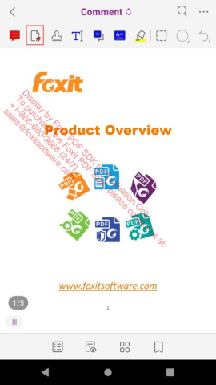

# 自定义UI

Foxit PDF SDK for Android为开发人员 提供了一个简单、干净和友好的用户界面，可以快速构建一个功能齐全的PDF应用程序而不需花费太多的时间在设计上。此外，自定义用户页面也非常简单。Foxit
PDF SDK for Android提供了UI Extensions组件的源代码 (包含即用型UI模块的实现)，这样开发人员可以根据需要灵活自定义界面的外观。

从4.0版本开始，开发人员可以通过一个配置文件对功能进行自定义。

从5.0版本开始，内置UI中的任何元素都是可配置的，并且为开发人员提供了更高级的APIs和更强大的配置文件用来进一步自定义UI元素，比如显示或隐藏一个特定的面板，top/bottom
toolbar，top/bottom toolbar中的菜单项，以及View setting bar和More Menu View中的菜单项。

从6.3版本开始，配置文件被进一步改进，提供了更多设置选项对UI进行自定义，包括权限管理和UI元素的属性。

从8.0版本开始，UI Extensions Component的内置UI进行了全新的改版。

以下部分将介绍如何通过配置文件、APIs、源代码自定义功能模块、权限管理和UI元素。

## 通过配置文件自定义UI

通过配置文件，开发人员可以轻松选择功能模块，设置权限管理和UI元素的属性，而无需编写任何额外的代码或者重新设计应用程序的UI。

#### JSON文件介绍

配置文件可以作为JSON文件提供，也可以直接在代码中编写。我们建议您使用JSON文件格式，因为其可以更直观，更清晰的查看和配置各个选项。

您可以参考Foxit PDF SDK for Android包中"samples\complete_pdf_viewer\app\src\main\res\raw"文件夹下的JSON文件。其内容如下所示：

```json
{
  "modules": {
    "readingbookmark": true,
    "outline": true,
    // "annotations":true,
    "annotations": {
      "highlight": true,
      "underline": true,
      "squiggly": true,
      "strikeout": true,
      "insert": true,
      "replace": true,
      "line": true,
      "rectangle": true,
      "oval": true,
      "arrow": true,
      "pencil": true,
      "eraser": true,
      "typewriter": true,
      "textbox": true,
      "callout": true,
      "note": true,
      "stamp": true,
      "polygon": true,
      "cloud": true,
      "polyline": true,
      "measure": true,
      "image": true,
      "audio": true,
      "video": true,
      "redaction": true
    },
    "thumbnail": true,
    "attachment": true,
    "signature": true,
    "fillSign": true,
    "search": true,
    "navigation": true,
    "form": true,
    "selection": true,
    "encryption": true,
    "multipleSelection": true
  },
  "permissions": {
    "runJavaScript": true,
    "copyText": true,
    "disableLink": false
  },
  "uiSettings": {
    "pageMode": "Single",
    "continuous": false,
    "reflowBackgroundColor": "#FFFFFF",
    "zoomMode": "FitWidth",
    "colorMode": "Normal",
    "mapForegroundColor": "#5d5b71",
    "mapBackgroundColor": "#00001b",
    "disableFormNavigationBar": false,
    "highlightForm": true,
    "highlightFormColor": "#200066cc",
    "highlightLink": true,
    "highlightLinkColor": "#16007fff",
    "fullscreen": true,
    "annotations": {
      "continuouslyAdd": true,
      "highlight": {
        "color": "#ffff00",
        "opacity": 1.0
      },
      "areaHighlight": {
        "color": "#ffff00",
        "opacity": 1.0
      },
      "underline": {
        "color": "#66cc33",
        "opacity": 1.0
      },
      "squiggly": {
        "color": "#993399",
        "opacity": 1.0
      },
      "strikeout": {
        "color": "#ff0000",
        "opacity": 1.0
      },
      "insert": {
        "color": "#993399",
        "opacity": 1.0
      },
      "replace": {
        "color": "#0000ff",
        "opacity": 1.0
      },
      "line": {
        "color": "#ff0000",
        "opacity": 1.0,
        "thickness": 2
      },
      "rectangle": {
        "color": "#ff0000",
        "opacity": 1.0,
        "thickness": 2
      },
      "oval": {
        "color": "#ff0000",
        "opacity": 1.0,
        "thickness": 2
      },
      "arrow": {
        "color": "#ff0000",
        "opacity": 1.0,
        "thickness": 2
      },
      "pencil": {
        "color": "#ff0000",
        "opacity": 1.0,
        "thickness": 2,
        "showPenOnlySwitch": true
      },
      "polygon": {
        "color": "#ff0000",
        "opacity": 1.0,
        "thickness": 2
      },
      "cloud": {
        "color": "#ff0000",
        "opacity": 1.0,
        "thickness": 2
      },
      "polyline": {
        "color": "#ff0000",
        "opacity": 1.0,
        "thickness": 2
      },
      "typewriter": {
        "textColor": "#0000ff",
        "opacity": 1.0,
        "textFace": "Courier",
        "textSize": 18
      },
      "textbox": {
        "color": "#ff0000",
        "textColor": "#0000ff",
        "opacity": 1.0,
        "textFace": "Courier",
        "textSize": 18
      },
      "callout": {
        "color": "#ff0000",
        "textColor": "#0000ff",
        "opacity": 1.0,
        "textFace": "Courier",
        "textSize": 18
      },
      "note": {
        "color": "#ff0000",
        "opacity": 1.0,
        "icon": "Comment"
      },
      "attachment": {
        "color": "#ff0000",
        "opacity": 1.0,
        "icon": "PushPin"
      },
      "image": {
        "rotation": 0,
        "opacity": 1.0
      },
      "measure": {
        "color": "#ff0000",
        "opacity": 1.0,
        "thickness": 2,
        "scaleFromUnit": "inch",
        "scaleToUnit": "inch",
        "scaleFromValue": 1,
        "scaleToValue": 1
      },
      "redaction": {
        "fillColor": "#000000",
        "textColor": "#ff0000",
        "textFace": "Courier",
        "textSize": 12
      }
    },
    "form": {
      "textField": {
        "textColor": "#000000",
        "textFace": "Courier",
        // textFace:"Courier"/"Helvetica"/"Times"
        "textSize": 0
        // 0 means auto-adjust font size (textSize >= 0)
      },
      "checkBox": {
        "textColor": "#000000"
      },
      "radioButton": {
        "textColor": "#000000"
      },
      "comboBox": {
        "textColor": "#000000",
        "textFace": "Courier",
        // textFace:"Courier"/"Helvetica"/"Times"
        "textSize": 0,
        // 0 means auto-adjust font size (textSize >= 0)
        "customText": false
      },
      "listBox": {
        "textColor": "#000000",
        "textFace": "Courier",
        // textFace:"Courier"/"Helvetica"/"Times"
        "textSize": 0,
        // 0 means auto-adjust font size (textSize >= 0)
        "multipleSelection": false
      }
    },
    "signature": {
      "color": "#000000",
      "thickness": 8
    }
  }
}
```

::: warning

- 上述JSON文件中的值是配置项的默认值。如果某些配置项不在JSON文件中，则将使用其默认值。例如，如果您注释掉" "highlight" :
  true ,", 但高亮功能仍然是可用的。
- 只有附件 (attachment) 注释是不受 "annotations" 的子项控制的。点击顶部工具栏 Home
  旁边的
  图标，选择 Comment ,
  可以看到附件注释，如Figure 4 - 1 所示。

  ``` "attachment" : true ```,"控制了attachments面板和attachment注释。如果您将其设置为"false", 则两者都将被禁用。如果您需要隐藏
  Comment 中的所有工具，那么您需要将" annotations " 和 " attachment "同时设置为 " false "。

  
  :::

#### 配置项描述

JSON配置文件包括三个部分：功能模块，权限管理和UI设置 (例如，UI元素属性) 。本节将详细介绍这些配置项。

**配置功能模块**

::: warning
功能模块项的值类型是 bool， 其中 " true "表示启用该功能模块，" false "表示将禁用该功能模块。默认值为 "true"。
:::

| 功能模块                                                                                                                                                                                                                                 | 描述                     |
|--------------------------------------------------------------------------------------------------------------------------------------------------------------------------------------------------------------------------------------|------------------------|
| readingbookmark                                                                                                                                                                                                                      | 用户定义书签                 |
| outline                                                                                                                                                                                                                              | pdf文档书签                |
| annotations (highlight, underline, squiggly, strikeout, insert, replace, line, rectangle, oval, arrow, pencil, eraser, typewriter, textbox, callout, note, stamp, polygon, cloud, polyline, measure, image, audio, video, redaction) | 注释模块集合                 |
| thumbnail                                                                                                                                                                                                                            | pdf页面缩略图显示和页面管理        |
| attachment                                                                                                                                                                                                                           | pdf文档附件和附件注释           |
| signature                                                                                                                                                                                                                            | 电子签名和手写签名              |
| fillSign                                                                                                                                                                                                                             | 用文本和符号填写扁平化表单（即非交互式表单） |
| search                                                                                                                                                                                                                               | 文本搜索                   |
| navigation                                                                                                                                                                                                                           | pdf页面导航                |
| form                                                                                                                                                                                                                                 | 表单填写和表单数据导入导出          |
| selection                                                                                                                                                                                                                            | 文本选择                   |
| encryption                                                                                                                                                                                                                           | pdf加密                  |
| multipleSelection                                                                                                                                                                                                                    | 选择多个annotations        |

#### 使用配置文件实例化一个UIExtensionsManager对象

**配置权限管理**

::: warning
配置项的值类型为 bool， 其中 " true " 表示将启用该权限，" false "表示将禁用该权限。runJavaScript 和 copyText 的默认值为 "
true"， disableLink 的默认值为 "false" 。
:::

| 权限管理          | 描述               |
|---------------|------------------|
| runJavaScript | 是否允许执行JavaScript |
| copyText      | 是否允许复制文本         |
| disableLink   | 是否禁用超链接          |

**配置UI项及其属性**

<table>
    <tr>
        <td>UI配置子项</td>
        <td width="80px">描述/属性</td>
        <td>值类型</td>
        <td>可选值</td>
        <td>默认值</td>
        <td>备注</td>
    </tr>
    <tr>
        <td>pageMode</td>
        <td>页面显示模式</td>
        <td>String</td>
        <td>
            Single/ <br>
            Facing/ <br>
            CoverLeft/ <br>
            CoverMiddle/ <br>
            CoverRight/ <br>
            Reflow
        </td>
        <td>Single</td>
        <td>动态XFA文件不支持Reflow模式。</td>
    </tr>
    <tr>
        <td>continuous</td>
        <td>是否连续的显示单页页面</td>
        <td>Bool</td>
        <td>true/false</td>
        <td>false</td>
        <td>true表示连续显示，false表示不连续显示。该配置项在"Reflow"模式下无效。</td>
    </tr>
    <tr>
        <td>reflowBackgroundColor</td>
        <td>Reflow(重排)页面的背景</td>
        <td>#RGB</td>
        <td></td>
        <td>#FFFFFF</td>
        <td></td>
    </tr>
    <tr>
        <td>zoomMode</td>
        <td>页面缩放模式</td>
        <td>String</td>
        <td>FitWidth/FitPage</td>
        <td>FitWidth</td>
        <td></td>
    </tr>
    <tr>
        <td>colorMode</td>
        <td>页面颜色显示模式</td>
        <td>String</td>
        <td>Normal/Night/Map</td>
        <td>Normal</td>
        <td>"Night" 是一种特殊的"Map"模式。</td>
    </tr>
    <tr>
        <td>mapForegroundColor</td>
        <td>页面显示的前景颜色</td>
        <td>RGB</td>
        <td>—</td>
        <td>#5d5b71</td>
        <td>只有在"colorMode"设置为"Map"时，该配置项才有效。</td>
    </tr>
    <tr>
        <td>mapBackgroundColor</td>
        <td>页面显示的背景颜色</td>
        <td>RGB</td>
        <td>—</td>
        <td>#00001b</td>
        <td>只有在"colorMode"设置为"Map"时，该配置项才有效。</td>
    </tr>
    <tr>
        <td>disableFormNavigationBar</td>
        <td>是否禁用表单的辅助导航栏</td>
        <td>Bool</td>
        <td>true/false</td>
        <td>false</td>
        <td></td>
    </tr>
    <tr>
        <td>highlightForm</td>
        <td>是否高亮表单域</td>
        <td>Bool</td>
        <td>true/false</td>
        <td>true</td>
        <td></td>
    </tr>
    <tr>
        <td>highlightFormColor</td>
        <td>表单高亮颜色</td>
        <td>ARGB</td>
        <td>—</td>
        <td>#200066cc</td>
        <td>包括alpha通道，并且对动态xfa文件无效。</td>
    </tr>
    <tr>
        <td>highlightLink</td>
        <td>是否高亮超链接</td>
        <td>Bool</td>
        <td>true/false</td>
        <td>true</td>
        <td></td>
    </tr>
    <tr>
        <td>highlightLinkColor</td>
        <td>超链接高亮颜色</td>
        <td>ARGB</td>
        <td>—</td>
        <td>#16007fff</td>
        <td>包括alpha通道。</td>
    </tr>
    <tr>
        <td>fullscreen</td>
        <td>是否全屏显示</td>
        <td>Bool</td>
        <td>true/false</td>
        <td>true</td>
        <td>
            当"fullscreen" 设置为"true"时，文档将以全屏方式显示。如果用户点击页面，工具栏将会出现。如果5秒内无任何动作，工具栏和其他辅助工具按钮将自动隐藏。
        </td>
    </tr>
    <tr>
        <td rowspan="70">annotations</td>
        <td>continuouslyAdd</td>
        <td></td>
        <td>Bool</td>
        <td>true/false</td>
        <td>true</td>
        <td>是否连续添加某个注释</td>
    </tr>
    <tr>
        <td rowspan="2">highlight</td>
        <td>color</td>
        <td>RGB</td>
        <td></td>
        <td>#ffff00</td>
        <td></td>
    </tr>
    <tr>
        <td>opacity</td>
        <td>numeric</td>
        <td>[0.0-1.0]</td>
        <td>1.0</td>
        <td></td>
    </tr>
    <tr>
        <td rowspan="2">areaHighlight</td>
        <td>color</td>
        <td>RGB</td>
        <td></td>
        <td>#ffff00</td>
        <td></td>
    </tr>
    <tr>
        <td>opacity</td>
        <td>numeric</td>
        <td>[0.0-1.0]</td>
        <td>1.0</td>
        <td>如果区域超出页面，则使用默认的配置。</td>
    </tr>
    <tr>
        <td rowspan="2">underline</td>
        <td>color</td>
        <td>RGB</td>
        <td></td>
        <td>#66cc33</td>
        <td></td>
    </tr>
    <tr>
        <td>opacity</td>
        <td>numeric</td>
        <td>[0.0-1.0]</td>
        <td>1.0</td>
        <td></td>
    </tr>
    <tr>
        <td rowspan="2">squiggly</td>
        <td>color</td>
        <td>RGB</td>
        <td></td>
        <td>#993399</td>
        <td></td>
    </tr>
    <tr>
        <td>opacity</td>
        <td>numeric</td>
        <td>[0.0-1.0]</td>
        <td>1.0</td>
        <td></td>
    </tr>
    <tr>
        <td rowspan="2">strikeout</td>
        <td>color</td>
        <td>RGB</td>
        <td></td>
        <td>#ff0000</td>
        <td></td>
    </tr>
    <tr>
        <td>opacity</td>
        <td>numeric</td>
        <td>[0.0-1.0]</td>
        <td>1.0</td>
        <td></td>
    </tr>
    <tr>
        <td rowspan="2">insert</td>
        <td>color</td>
        <td>RGB</td>
        <td></td>
        <td>#993399</td>
        <td></td>
    </tr>
    <tr>
        <td>opacity</td>
        <td>numeric</td>
        <td>[0.0-1.0]</td>
        <td>1.0</td>
        <td></td>
    </tr>
    <tr>
        <td rowspan="2">replace</td>
        <td>color</td>
        <td>RGB</td>
        <td></td>
        <td>#0000ff</td>
        <td></td>
    </tr>
    <tr>
        <td>opacity</td>
        <td>numeric</td>
        <td>[0.0-1.0]</td>
        <td>1.0</td>
        <td></td>
    </tr>
    <tr>
        <td rowspan="3">line</td>
        <td>color</td>
        <td>RGB</td>
        <td></td>
        <td>#ff0000</td>
        <td></td>
    </tr>
    <tr>
        <td>opacity</td>
        <td>numeric</td>
        <td>[0.0-1.0]</td>
        <td>1.0</td>
        <td></td>
    </tr>
    <tr>
        <td>thickness</td>
        <td>numeric</td>
        <td>[1-12]</td>
        <td>2</td>
        <td></td>
    </tr>
    <tr>
        <td rowspan="3">oval</td>
        <td>color</td>
        <td>RGB</td>
        <td></td>
        <td>#ff0000</td>
        <td></td>
    </tr>
    <tr>
        <td>opacity</td>
        <td>numeric</td>
        <td>[0.0-1.0]</td>
        <td>1.0</td>
        <td></td>
    </tr>
    <tr>
        <td>thickness</td>
        <td>numeric</td>
        <td>[1-12]</td>
        <td>2</td>
        <td></td>
    </tr>
    <tr>
        <td rowspan="3">arrow</td>
        <td>color</td>
        <td>RGB</td>
        <td></td>
        <td>#ff0000</td>
        <td></td>
    </tr>
    <tr>
        <td>opacity</td>
        <td>numeric</td>
        <td>[0.0-1.0]</td>
        <td>1.0</td>
        <td></td>
    </tr>
    <tr>
        <td>thickness</td>
        <td>numeric</td>
        <td>[1-12]</td>
        <td>2</td>
        <td></td>
    </tr>
    <tr>
        <td rowspan="4">pencil</td>
        <td>color</td>
        <td>RGB</td>
        <td></td>
        <td>#ff0000</td>
        <td></td>
    </tr>
    <tr>
        <td>opacity</td>
        <td>numeric</td>
        <td>[0.0-1.0]</td>
        <td>1.0</td>
        <td></td>
    </tr>
    <tr>
        <td>thickness</td>
        <td>numeric</td>
        <td>[1-12]</td>
        <td>2</td>
        <td></td>
    </tr>
    <tr>
        <td>showPenOnlySwitch</td>
        <td>Bool</td>
        <td>true/false</td>
        <td>true</td>
        <td>是否显示 pen only 开关</td>
    </tr>
    <tr>
        <td rowspan="3">polygon</td>
        <td>color</td>
        <td>RGB</td>
        <td></td>
        <td>#ff0000</td>
        <td></td>
    </tr>
    <tr>
        <td>opacity</td>
        <td>numeric</td>
        <td>[0.0-1.0]</td>
        <td>1.0</td>
        <td></td>
    </tr>
    <tr>
        <td>thickness</td>
        <td>numeric</td>
        <td>[1-12]</td>
        <td>2</td>
        <td></td>
    </tr>
    <tr>
        <td rowspan="3">cloud</td>
        <td>color</td>
        <td>RGB</td>
        <td></td>
        <td>#ff0000</td>
        <td></td>
    </tr>
    <tr>
        <td>opacity</td>
        <td>numeric</td>
        <td>[0.0-1.0]</td>
        <td>1.0</td>
        <td></td>
    </tr>
    <tr>
        <td>thickness</td>
        <td>numeric</td>
        <td>[1-12]</td>
        <td>2</td>
        <td></td>
    </tr>
    <tr>
        <td rowspan="3">polyline</td>
        <td>color</td>
        <td>RGB</td>
        <td></td>
        <td>#ff0000</td>
        <td></td>
    </tr>
    <tr>
        <td>opacity</td>
        <td>numeric</td>
        <td>[0.0-1.0]</td>
        <td>1.0</td>
        <td></td>
    </tr>
    <tr>
        <td>thickness</td>
        <td>numeric</td>
        <td>[1-12]</td>
        <td>2</td>
        <td></td>
    </tr>
    <tr>
        <td rowspan="4">typewriter</td>
        <td>textColor</td>
        <td>RGB</td>
        <td></td>
        <td>#0000ff</td>
        <td></td>
    </tr>
    <tr>
        <td>opacity</td>
        <td>numeric</td>
        <td>[0.0-1.0]</td>
        <td>1.0</td>
        <td></td>
    </tr>
    <tr>
        <td>textFace</td>
        <td>String</td>
        <td>Courier/Helvetica/Times</td>
        <td>Courier</td>
        <td>文本字体名称。如果设置为非法值，则使用默认字体。</td>
    </tr>
    <tr>
        <td>textSize</td>
        <td>Integer</td>
        <td>>=1</td>
        <td>18</td>
        <td></td>
    </tr>
    <tr>
        <td rowspan="5">textbox</td>
        <td>color</td>
        <td>RGB</td>
        <td></td>
        <td>#ff0000</td>
        <td></td>
    </tr>
    <tr>
        <td>textColor</td>
        <td>RGB</td>
        <td></td>
        <td>#0000ff</td>
        <td></td>
    </tr>
    <tr>
        <td>opacity</td>
        <td>numeric</td>
        <td>[0.0-1.0]</td>
        <td>1.0</td>
        <td></td>
    </tr>
    <tr>
        <td>textFace</td>
        <td>String</td>
        <td>Courier/Helvetica/Times</td>
        <td>Courier</td>
        <td>文本字体名称。如果设置为非法值，则使用默认字体。</td>
    </tr>
    <tr>
        <td>textSize</td>
        <td>Integer</td>
        <td>>=1</td>
        <td>18</td>
        <td></td>
    </tr>
    <tr>
        <td rowspan="5">callout</td>
        <td>color</td>
        <td>RGB</td>
        <td></td>
        <td>#ff0000</td>
        <td></td>
    </tr>
    <tr>
        <td>textColor</td>
        <td>RGB</td>
        <td></td>
        <td>#0000ff</td>
        <td></td>
    </tr>
    <tr>
        <td>opacity</td>
        <td>numeric</td>
        <td>[0.0-1.0]</td>
        <td>1.0</td>
        <td></td>
    </tr>
    <tr>
        <td>textFace</td>
        <td>String</td>
        <td>Courier/Helvetica/Times</td>
        <td>Courier</td>
        <td>文本字体名称。如果设置为非法值，则使用默认字体。</td>
    </tr>
    <tr>
        <td>textSize</td>
        <td>Integer</td>
        <td>>=1</td>
        <td>18</td>
        <td></td>
    </tr>
    <tr>
        <td rowspan="3">note</td>
        <td>color</td>
        <td>RGB</td>
        <td></td>
        <td>#ff0000</td>
        <td></td>
    </tr>
    <tr>
        <td>opacity</td>
        <td>numeric</td>
        <td>[0.0-1.0]</td>
        <td>1.0</td>
        <td></td>
    </tr>
    <tr>
        <td>icon</td>
        <td>String</td>
        <td>Comment/Key/Note/Help/NewParagraph/Paragraph/Insert</td>
        <td>Comment</td>
        <td>如果设置为非法值，则使用默认值。</td>
    </tr>
    <tr>
        <td rowspan="3">attachment</td>
        <td>color</td>
        <td>RGB</td>
        <td></td>
        <td>#ff0000</td>
        <td></td>
    </tr>
    <tr>
        <td>opacity</td>
        <td>numeric</td>
        <td>[0.0-1.0]</td>
        <td>1.0</td>
        <td></td>
    </tr>
    <tr>
        <td>icon</td>
        <td>String</td>
        <td>Graph/PushPin/Paperclip/Tag</td>
        <td>PushPin</td>
        <td>如果设置为非法值，则使用默认值。</td>
    </tr>
    <tr>
        <td rowspan="2">image</td>
        <td>rotation</td>
        <td>numeric</td>
        <td>0/90/180/270</td>
        <td>0</td>
        <td></td>
    </tr>
    <tr>
        <td>opacity</td>
        <td>numeric</td>
        <td>[0.0-1.0]</td>
        <td>1.0</td>
        <td></td>
    </tr>
    <tr>
        <td rowspan="7">measure</td>
        <td>color</td>
        <td>RGB</td>
        <td></td>
        <td>#ff0000</td>
        <td></td>
    </tr>
    <tr>
        <td>opacity</td>
        <td>numeric</td>
        <td>[0.0-1.0]</td>
        <td>1.0</td>
        <td></td>
    </tr>
    <tr>
        <td>thickness</td>
        <td>numeric</td>
        <td>[1-12]</td>
        <td>2</td>
        <td></td>
    </tr>
    <tr>
        <td>scaleFromUnit</td>
        <td>String</td>
        <td>pt/m/cm/mm/inch/p/ft/yd</td>
        <td>inch</td>
        <td>缩放的基准单位。</td>
    </tr>
    <tr>
        <td>scaleToUnit</td>
        <td>String</td>
        <td>pt/m/cm/mm/inch/p/ft/yd</td>
        <td>inch</td>
        <td>缩放的目标单位。</td>
    </tr>
    <tr>
        <td>scaleFromValue</td>
        <td>numeric</td>
        <td></td>
        <td>1</td>
        <td>缩放的基准数值。</td>
    </tr>
    <tr>
        <td>scaleToValue</td>
        <td>numeric</td>
        <td></td>
        <td>1</td>
        <td>缩放的目标数值。</td>
    </tr>
    <tr>
        <td rowspan="4">redaction</td>
        <td>fillColor</td>
        <td>RGB</td>
        <td></td>
        <td>#000000</td>
        <td></td>
    </tr>
    <tr>
        <td>textColor</td>
        <td>RGB</td>
        <td></td>
        <td>#ff0000</td>
        <td></td>
    </tr>
    <tr>
        <td>textFace</td>
        <td>String</td>
        <td>Courier/Helvetica/Times</td>
        <td>Courier</td>
        <td>文本字体名称。如果设置为非法值，则使用默认字体。</td>
    </tr>
    <tr>
        <td>textSize</td>
        <td>Integer</td>
        <td>>=1</td>
        <td>12</td>
        <td></td>
    </tr>
    <tr>
        <td rowspan="13">form</td>
        <td rowspan="3">textField</td>
        <td>textColor</td>
        <td>RGB</td>
        <td>默认值</td>
        <td>#000000</td>
        <td></td>
    </tr>
    <tr>
        <td>textFace</td>
        <td>String</td>
        <td>Courier/Helvetica/Times</td>
        <td>Courier</td>
        <td>文本字体名称。如果设置为非法值，则使用默认字体。</td>
    </tr>
    <tr>
        <td>textSize</td>
        <td>Integer</td>
        <td>>=0</td>
        <td>12</td>
        <td>0 表示自动调整字体大小。</td>
    </tr>
    <tr>
        <td>checkBox</td>
        <td>textColor</td>
        <td>RGB</td>
        <td>默认值</td>
        <td>#000000</td>
        <td></td>
    </tr>
    <tr>
        <td>radioButton</td>
        <td>textColor</td>
        <td>RGB</td>
        <td>默认值</td>
        <td>#000000</td>
        <td></td>
    </tr>
    <tr>
        <td rowspan="4">comboBox</td>
        <td>textColor</td>
        <td>RGB</td>
        <td></td>
        <td>#000000</td>
        <td></td>
    </tr>
    <tr>
        <td>textFace</td>
        <td>String</td>
        <td>Courier/Helvetica/Times</td>
        <td>Courier</td>
        <td>文本字体名称。如果设置为非法值，则使用默认字体。</td>
    </tr>
    <tr>
        <td>textSize</td>
        <td>Integer</td>
        <td>>=0</td>
        <td>0</td>
        <td>0 表示自动调整字体大小。</td>
    </tr>
    <tr>
        <td>customText</td>
        <td>Bool</td>
        <td>true/false</td>
        <td>false</td>
        <td>true表示允许自定义文本。false表示不允许自定义文本。</td>
    </tr>
    <tr>
        <td rowspan="4">listBox</td>
        <td>textColor</td>
        <td>RGB</td>
        <td></td>
        <td>#000000</td>
        <td></td>
    </tr>
    <tr>
        <td>textFace</td>
        <td>String</td>
        <td>Courier/Helvetica/Times</td>
        <td>Courier</td>
        <td>文本字体名称。如果设置为非法值，则使用默认字体。</td>
    </tr>
    <tr>
        <td>textSize</td>
        <td>Integer</td>
        <td>>=0</td>
        <td>0</td>
        <td>0 表示自动调整字体大小。</td>
    </tr>
    <tr>
        <td>multipleSelection</td>
        <td>Bool</td>
        <td>true/false</td>
        <td>false</td>
        <td>true表示支持多选。false表示不支持多选。</td>
    </tr>
    <tr>
        <td rowspan="2">signature</td>
        <td>color</td>
        <td>RGB</td>
        <td></td>
        <td>#000000</td>
        <td></td>
    </tr>
    <tr>
        <td>thickness</td>
        <td>numeric</td>
        <td>[1-12]</td>
        <td>8</td>
        <td></td>
    </tr>
</table>

#### 使用配置文件实例化一个UIExtensionsManager对象

在"使用UI Extensions组件构建一个功能齐全的PDF阅读器"
，我们已经介绍了如何实例化UIExtensionsManager，而且使用这种方式，所有的内置UI框架将会被默认加载。在本节中，我们将提供另外一种使用配置文件来实例化一个UIExtensionsManager，以便开发人员可以根据需要轻松自定义UI。

请参阅以下代码使用配置文件实例化UIExtensionsManager对象。

::: warning
在这里，我们假设您已经将名为"uiextensions_config.json"的JSON文件放到"PDFReader\app\src\main\res\raw"文件夹下 (
请注意，您需要自己创建 "raw" 文件夹)。
:::

在 "MainActivity.java" 中：

```java 
import com.foxit.uiextensions.config.Config;

private PDFViewCtrl pdfViewCtrl = null;
private UIExtensionsManager uiExtensionsManager = null;

// Initialize a PDFViewCtrl object.
pdfViewCtrl = new PDFViewCtrl(this);

// Get the config file, and set it to UIExtensionsManager.
InputStream stream = this.getApplicationContext().getResources().openRawResource(R.raw.uiextensions_config);
Config config = new Config(stream);

// Initialize a UIExtensionManager object with Configuration file, and set it to PDFViewCtrl.
uiExtensionsManager = new UIExtensionsManager(this.getApplicationContext(), pdfViewCtrl, config);
pdfViewCtrl.setUIExtensionsManager(uiExtensionsManager);
uiExtensionsManager.setAttachedActivity(this);
uiExtensionsManager.onCreate(this, pdfViewCtrl, savedInstanceState);
```

::: warning
在上述代码中，我们使用一个配置文件来实例化UIExtensionsManager。如果您不想使用配置文件，可参考 "使用UI
Extensions组件构建一个功能齐全的PDF阅读器"。
:::

#### 通过配置文件自定义UI的示例

## 通过APIs自定义UI元素

#### 自定义 top/bottom toolbar

#### 自定义添加/移除一个特定的面板

#### 自定义隐藏View setting bar上的UI元素

#### 自定义添加/隐藏More Menu菜单上的UI元素

## 通过源代码自定义UI实现