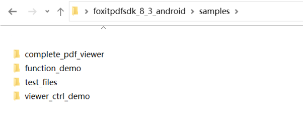
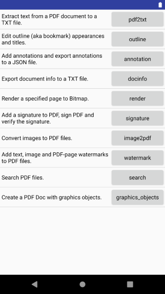
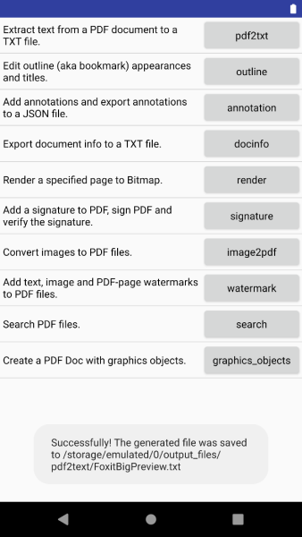
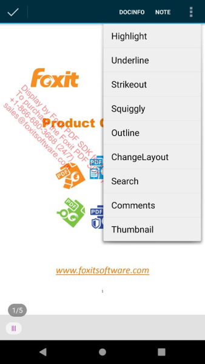
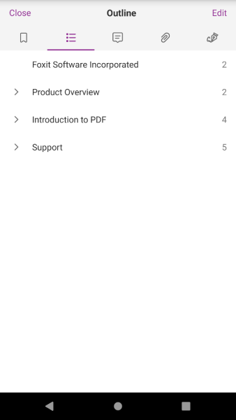
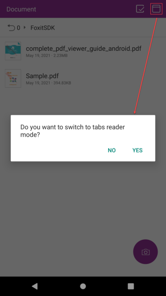
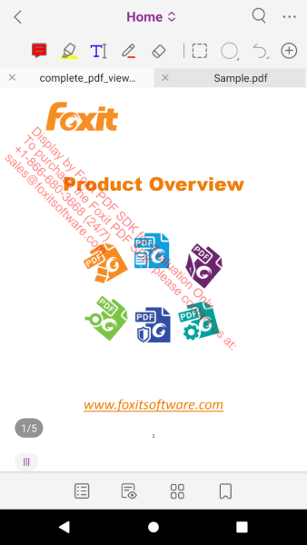
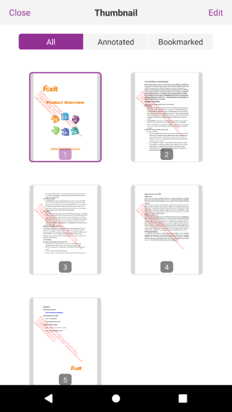

# 入门指南

## 系统要求

- Android 设备要求
    - Android 4.4(API 19)或更高版本
    - 32/64-bit ARM (armeabi-v7a/arm64-v8a) or 32/64-bit Intel x86 CPU
- Android Studio 3.2 or newer (支持AndroidX)

#### 包中Demos的运行环境

- Android Studio 4.1
- JDK 1.8
- Gradle Version 4.6
- Gradle Build Tool 3.2

::: warning
从7.2版本开始，Foxit PDF SDK for Android将只支持AndroidX，而不再支持Android support library。
:::

## 包结构说明

下载 "foxitpdfsdk_x_x_android.zip"包，解压到一个新的目录如 "foxitpdfsdk_x_x_android"，其中解压包中包括如下的内容：

```text
├─ docs                             <--- API手册，开发文档和升级说明文档
├─ icc_profile                      <--- 输出预览功能所使用的默认icc profile文件
├─ libs                             <--- License文件，AAR，UI Extensions组件源代码
├─ samples                          <--- Android示例工程
├─ getting_started_android.pdf      <--- Foxit PDF SDK for Android快速入门
├─ legal.txt                        <--- 法律和版权信息
└─ release_notes.txt                <--- 发布信息
```

libs目录如下：

| 文件名                         | 描述                                        |
|-----------------------------|-------------------------------------------|
| docs                        | API手册，开发文档和升级说明文档                         |
| icc_profile                 | 输出预览(output preview)功能所使用的默认icc profile文件 |
| libs                        | License文件，AAR，UI Extensions组件源代码          |
| samples                     | Android示例工程                               |
| getting_started_android.pdf | Foxit PDF SDK for Android快速入门             |
| legal.txt                   | 法律和版权信息                                   |
| release_notes.txt           | 发布信息                                      |

```text
└─ libs                             <--- License文件，AAR，UI Extensions组件源代码
   ├─ pdfscan                       <--- 扫描功能组件源码
   ├─ uiextensions_src              <--- UI Extensions组件库源码
   ├─ FoxitRDK.aar                  <--- Foxit PDF SDK for Android核心包
   ├─ FoxitRDKUIExtensions.aar      <--- 提供UI Extensions组件所需要的库
   ├─ FoxitMobileScanningRDK.aar    <--- 提供扫描功能所需要的库
   ├─ FoxitPDFScan-UI.aar           <--- 提供实现扫描功能所需UI的Android Activities
   ├─ RMSSDK-x.x-release.aar        <--- 微软权限管理系统的软件开发包
   ├─ rms-sdk-ui.aar                <--- 提供实现RMS SDK功能所需UI的Android Activities
   ├─ rdk_key.txt                   <--- 示例 License key
   └─ rdk_sn.txt                    <--- 示例 License sn
```

| 包名                         | 描述                                                                                                                                                   |
|----------------------------|------------------------------------------------------------------------------------------------------------------------------------------------------|
| FoxitRDK.aar               | Foxit PDF SDK for Android的所有Java APIs，以及".so"库。".so"库是SDK的核心包含了Foxit PDF SDK for Android的核心函数。它针对每种架构单独编译，当期支持armeabi-v7a, arm64-v8a, x86,和x86_64架构。 |
| uiextensions_src           | 一个开源库，包含了一些即用型的UI模块实现，可以帮助开发人员快速将功能齐全的PDF阅读器嵌入到他们的Android应用中。当然，开发人员也不是必须要使用默认的UI，可以通过"uiextensions_src"工程为特定的应用灵活自定义和设计UI。                          |
| FoxitRDKUIExtensions.aar   | 内置UI实现，以及UI所需要的资源文件，如图片，字符串、颜色值、布局文件以及其他Android UI资源。                                                                                                |
| FoxitMobileScanningRDK.aar | 提供扫描功能所需要的库。                                                                                                                                         |
| FoxitPDFScan-UI.aar        | 提供实现扫描功能所需UI的Android Activities。                                                                                                                     |
| RMSSDK-x.x-release.aar     | 微软权限管理系统的软件开发包。更多详细信息，[请参考](https://www.microsoft.com/en-ie/download/details.aspx?id=43673).                                                         |
| rms-sdk-ui.aar             | 提供实现RMS SDK功能所需UI的Android Activities。更多详细信息，[请参考](https://github.com/AzureAD/rms-sdk-ui-for-android).                                                |
| pdfscan                    | 一个开源库，包含了扫描功能相关的UI实现，可以帮助开发人员快速将扫描功能集成到他们的Android应用中，或者根据需要自定义扫描功能的UI。                                                                               |

::: warning
为了减小FoxitRDKUIExtensions.aar的文件大小，Foxit PDF SDK for
Android在uiextensions_src工程中使用shrink-code技术。如果您在编译Uiextensions_src工程时，不需使用
shrink-code，您可以在App下的build.gradle中通过设置"minifyEnabled"为"false"来进行禁用。关
于shrink-code，[请参考](https://developer.android.com/studio/build/shrink-code.html).
:::

## 运行demo

下载和安装Android Studio
IDE [https://developer.android.com/studio/index.html](https://developer.android.com/studio/index.html).

::: warning
在本指南中，不具体介绍Android Studio、Android SDK 和JDK的安装步骤。如果您还没有安 装，请参考Android Studio的开发官网。
:::

Foxit PDF SDK for Android 为开发人员提供了三种不同类型的demos，用来展示如何调用SDK，如下图：



### Function demo

Function demo用来展示如何使用Foxit PDF SDK for Android的core API来实现一些PDF特定的功能。该demo包括如下的功能：

- **pdf2txt**：从PDF文档中提取文本，并保存到一个TXT文件中。
- **outline**：编辑大纲(也称为书签)的外观和主题。
- **annotation**：向PDF页面添加annotations和以JSON文件格式导出annotations。
- **docinfo**：导出PDF文档信息到TXT文件中。
- **render**：将指定的PDF页面渲染为位图。
- **signature**：向PDF中添加签名，对PDF签名和验证签名。
- **image2pdf**：将图像转化为PDF文件。
- **watermark**：向 PDF 文件添加文本、图像和 PDF 页面水印。
- **search**：搜索PDF文件。
- **graphics_objects**：使用图形对象创建 PDF 文档。

在Android Studio中运行该demo，请按如下的步骤：

1. 在Android Studio中打开demo，通过 "File -> New -> Import Project..." 或者 "File -> Open...",
   然后找到function_demo所在的位置，选择function_demo。点击"OK"。

2. 开启一个Android设备或者模拟器(AVD)。在本章中，将使用模拟器AVD 10.0来运行demo。Demo所需要的测试文件在demo运行时会被自动拷贝到模拟器的存储卡中，测试文件
   在 "samples/test_files"文件夹下。

3. 点击"Run -> Run 'app'" 来运行demo。当在模拟器上安装完APK后，在弹出的窗口点击"**Allow**"
   允许demo访问设备上的文件。然后您就能看到如下图所示的功能选项。

   

4. 点击上图中的功能按钮去执行相应的操作。例如，点击 "pdf2txt", 则会弹出如下图所示的消息框，提示转换后的文本文件保存的位置。请运行demo并自由体验其功能。

   

### Viewer control demo

Viewer control demo阐述如何使用Foxit PDF SDK for Android实现与View Control功能层相关的功能，比如操作annotations (
注释、高亮、下划线、删除线、波浪线等)
，修改布局，文本搜索，大纲和页面缩略图。该demo的代码逻辑结构非常清晰和简单，开发人员可以快速定位PDF应用，比如PDF阅读器中某个功能的具体实现。并且通过这个demo，开发人员可以更进一步的接触和了解Foxit
PDF SDK for Android所提供的APIs。

在Android Studio中运行该demo，请参考Function demo 中的步骤。Viewer control demo不会自动拷贝测试文件到Android
设备或者模拟器中。该demo使用"sample.pdf" (在"samples/test_files"文件夹下)
作为测试文件，请确保在运行demo之前，您已经将该文件添加到Android设备或者模拟器中创建的"input_files" (或者"FoxitSDK"
，取决于您在demo中的设置)。

Demo成功运行后会如下图所示所示。这里，使用AVD 10.0来运行demo。


点击页面上的任意位置，会出现上下文操作栏，然后点击 (更多按钮) 去查看更多的功能操作选项，如下图所示。



现在，可以选择其中一个选项执行，并且查看其结果。比如，点击"Outline"，您会看到该测试文档的大纲目录(
outline在PDF规范中指的是书签)，如下图所示。您可以自行尝试其他的功能选项。



### Complete PDF viewer demo

Complete PDF Viewer demo阐述了如何通过使用Foxit PDF SDK for
Android实现一个功能齐全的PDF阅读器，该阅读器几乎可以作为实际移动端的PDF阅读器使用。而且从6.0版本开始，支持多文件阅读模式。该demo使用了Foxit
PDF SDK for Android所提供的所有功能和内置UI实现。

在Android Studio中运行该demo，请参考Function demo 中的步骤。

在运行该demo时，"samples\complete_pdf_viewer\app\src\main\assets"目录下的"complete_pdf_viewer_guide_android.pdf" 和 "
Sample.pdf" 文件将会被自动拷贝到模拟器的"FoxitSDK"文件夹下。

这里，将使用AVD 10.0 来运行demo。当成功运行后，屏幕会列出"complete_pdf_viewer_guide_android.pdf" 和 "Sample.pdf"
文档。如果您想要阅读多个文档，点击
切换到多文档阅读模式 (如下图所示)。

::: warning
"complete_pdf_viewer_guide_android.pdf" 和 "Sample.pdf"会自动部署到您运行的设备中，
因此您不需要手动将其添加到设备中。如果您想使用其他的PDF文档来测试该demo，您需要手动将
其添加到设备的SD卡中。
:::



点击 YES 切换到多文档阅读模式。选择"complete_pdf_viewer_guide_android.pdf"
文档，点击Back按钮
，再选择"Sample.pdf"
，如下图所示。现在，您可以通过切换选项卡浏览这两个文档。



该demo实现了一个功能齐全的PDF阅读器，请随意体验。

例如，它提供了页面缩略图功能。您可以点击底部工具栏上的缩略图菜单
，然后可以看到如下图所示的文档的缩略图。


