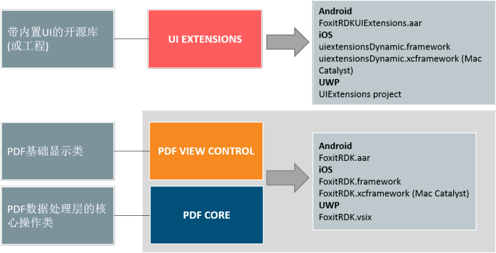
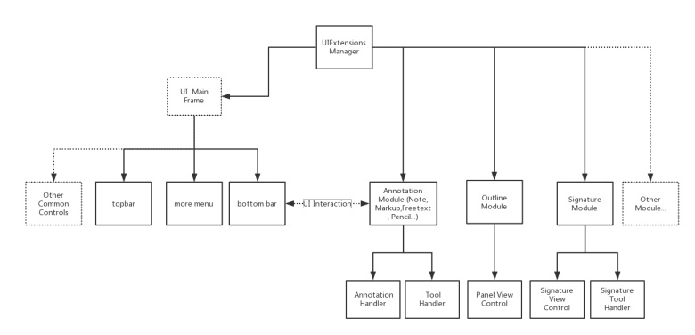
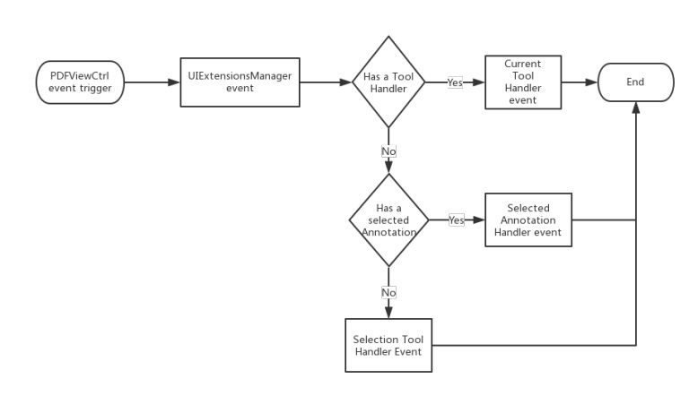

# Foxit PDF SDK简介

## Foxit PDF SDK

Foxit PDF SDK提供高性能的开发库，帮助软件开发人员使用最流行的开发语言和环境在不同平台 (
包括Windows、Mac、Linux、Web、Android、iOS 和 UWP) 的企业版、移动版和云应用程序中添加强大的PDF功能。

使用Foxit PDF SDK的应用开发人员可以利用Foxit强大、标准化的PDF技术安全地显示、创建、编辑、批注、格式化、管理、打印、共享，搜索PDF文档，以及填写PDF文档。此外，Foxit
PDF SDK包括一个内置可嵌入的PDF Viewer，使得开发过程更加简单和快速。

有关更多详细信息，可以访问网站[https://developers.foxitsoftware.cn/pdf-sdk/](https://developers.foxitsoftware.cn/pdf-sdk/)。

在本指南中，我们将重点介绍Foxit PDF SDK for Android 平台。

## Foxit PDF SDK for Android

您是否曾经为PDF规范的复杂性而感到不知所措？您是否曾经为被要求在有限的时间内构建一个功能齐全的PDF应用而感到迷茫。如果您的答案是"
Yes", 那么恭喜您！您找到了在业界中快速将PDF功能集成到应用程序中的优选方案。

Foxit PDF SDK for Android 致力于帮助开发人员快速将强大的Foxit PDF技术集成到他们自己的移动端应用程序中。通过Foxit
开发包，即使是对PDF了解有限的开发人员也可以在Android平台上用几行代码快速构建一个专业的PDF阅读器。

## 为什么选择Foxit PDF SDK for Android

Foxit 是领先的PDF软件解决方案供应商，专注于PDF显示、编辑、创建、管理以及安全方面。Foxit PDF SDK
开发库已在当今许多知名的应用程序中使用，并且经过长期的测试证明Foxit PDF SDK的质量、性能和功能正是业界大部分应用程序所需要的。Foxit
PDF SDK for Android 提供了快速PDF阅读和Android设备的操作控制。选择Foxit PDF SDK for Android的几大理由：

- **易于集成**

  开发人员可以通过几行代码将SDK无缝集成到他们自己的应用程序中。

- **设计完美**

  Foxit PDF SDK for Android 拥有简单、干净和友好的风格，并且提供了最好的用户体验。

- **灵活定制**

  Foxit PDF SDK for Android 提供了应用层用户界面的源代码，可以帮助开发人员对应用程序的功能和界面外观进行灵活定制。

- **移动平台上的鲁棒性**

  Foxit PDF SDK for Android 提供了OOM (内存溢出) 恢复机制，以确保应用程序在内存有限的移动设备上运行时仍然具备较高的鲁棒性。

- **基于福昕高保真的PDF渲染引擎**

  Foxit PDF SDK的核心技术是基于世界众多知名企业所信赖的福昕PDF引擎。福昕强大的PDF引擎可快速解析和渲染文档，不受设备环境的约束。

- **优秀的技术支持**

  福昕对自己的开发产品提供了优秀的技术支持，当您在开发关键重要的产品时，可以提供高效的帮助和支持。福昕拥有一支PDF行业优秀的技术支持工程师团队，同时将定期地进行版本更新发布，通过添加新的功能和增强已有的功能来提升用户体验。

## Foxit PDF SDK for Android的主要框架

Foxit PDF SDK for Android 由三个元素组成，如下图所示。Foxit PDF SDK的所有移动平台版本共享此结构，这样便于在您的应用程序中集成，以及支持多种手机操作系统和框架。



- **PDF Core API**

  PDF Core API 是SDK的核心部分，建立在福昕强大的底层PDF技术上。它提供了PDF基础功能操作相关的函数，包含了PDF View控件和UI
  Extensions组件中使用到的PDF核心处理功能，以确保应 用程序达到高的性能和效率。该API
  可单独用于文档的渲染、分析、文本提取、文本搜索、表单填写、数字签名、压感笔迹 (PSI) 、证书和密码加密、注释的创建和管理等等。

- **PDF View Control**

  PDF View控件是一个工具类，根据开发人员的需求提供开发人员与渲染的PDF文档进行交互所需要的功能接口。以福昕享有盛誉且使用广泛的PDF渲染技术为核心，View
  Control支持快速高质量的渲染、缩放、滚动和页面导览功能。该View控件继承于平台相关viewer的类，例如Android.View.ViewGroup,
  并且允许进行扩展来满足特定用户的需求。

- **UI Extensions 组件**

  UI Extensions 组件是一个带内置UI的开源库，支持对内置的文本选择，标记注释、大纲导航、阅读书签、全文检索、填表、文本重排、文档附件、数字/手写签名、文档编辑和密码加密等功能进行自定义。UI
  Extensions组件中的这些功能是通过使用PDF core API和PDF View
  Control来实现的。开发人员可以利用这些已有的UI实现快速构建一个PDF阅读器，同时可以根据需要灵活自定义其UI界面。

::: warning
从4.0版本开始，Foxit PDF SDK for Android对UI Extensions
组件做了一个重大的改变和优化。将基础的UI实现都封装到PDFReader类中，比如面板控件、工具栏设置、以及预警视图对话框等。因此，构建一个功能齐全的PDF阅读器变得越来越简单和容易。此外，用户可以通过一个配置文件灵活自定义他们需要的功能。
:::

::: warning
从5.0版本开始，
内置UI中的任何元素都可以通过API来进行自定义。该版本为开发人员提供了更高级的APIs和更强大的配置文件来对UI元素进行自定义，比如向工具栏中添加新的功能按钮，或者从工具栏中移除已有的功能按钮，显示/隐藏特定的菜单或者功能面板等。
:::

::: warning
从6.0版本开始，Foxit PDF SDK for Android移除了PDFReader类，将PDFReader类中封装的APIs移到了UI Extensions组件中。
:::

### UI Extensions组件概述

UI Extensions组件采用module机制，将每个功能细化成一个module。当加入UI Extensions时，所有的modules除了LocalModule(
用于文件管理)会被默认自动加载。用户可以通过实现Module接口类来自定义module，然后调用 UIExtensionsManager#registerModule
在当前UIExtensions Manager中进行注册。如果不需要使用时，可以调用 UIExtensionsManager#unregisterModule 进行反注册。

UIExtensionsManager包含了主框架UI，如top/bottom toolbar,
以及各个模块之间共享的UI组件。同时，各个功能模块也可以通过UIExtensionsManager来进行单独加载。功能模块在加载的时候会对主框架UI进行适配和调整，
并且建立起消息事件响应的联系。各个功能模块可能包含了其模块特有的UI组件，同时也会有自己独立的消息事件处理逻辑。UIExtensionsManager也会负责将从
View Control组件接收到的消息和事件分发到各个功能模块中去。下面的图片讲述了 UIExtensionsManager和modules之间的详细关系。



Tool handler与annotation handler处理来自PDFViewCtrl的触屏、手势等事件。当触屏和手势事件触发时，PDFViewCtrl会将相应的事件传递给UIExtensionsManager：

1. 如果当前存在tool handler, UIExtensionsManager会将相应的事件传递给当前的tool handle，然后事件处理过程结束。

2. 如果当前有选择annotation，UIExtensionsManager会将相应的事件传递给当前所选择的annotation对应的annotation
   handler，然后事件处理过程结束。

3. 如果当前不存在tool handler，也没有选中的annotation，那么UIExtensionsManager会将相应的事件传递给selection tool
   handler。Text Selection tool用于文本选择相关事件的处理，例如选择一段文本添加highlight annotation。Blank Selection
   tool用于空白处相关事件的处理，例如在空白处添加Note annotation。

::: warning
Tool Handler和Annotation Handler不会同时响应事件。Tool Handler主要用于annotation的创建(目前不支持Link
Annotation的创建)、signature的创建和文本选择。Annotation Handler主要用于annotation的编辑以及表单填写。下图讲述了Tool
Handler和Annotation Handler之间的事件响应流程。
:::



### Foxit PDF SDK for Android的主要功能

Foxit PDF SDK for Android包括了一些主要的功能，用来帮助应用程序开发人员在快速实现他们所需要的功能的同时减少开发成本。 功能
描述

| 功能               | 描述                                                                         |
|------------------|----------------------------------------------------------------------------|
| PDF Document     |                                                                            |
| PDF Page         | 解析、渲染、阅读、编辑文档页面。                                                           |
| Render           | 平台图像设备在bitmap上创建图像渲染引擎。                                                    |
| Reflow           | 重排页面内容。                                                                    |
| Crop             | 裁剪PDF页面。                                                                   |
| Text Select      | 文本选择。                                                                      |
| Text Search      | 文本搜索，并且支持全文索引搜索。                                                           |
| Outline          | 定位和链接到文档中的兴趣点。                                                             |
| Reading Bookmark | 标记文档中感兴趣的页面和段落位置。                                                          |
| Annotation       | 创建、编辑和移除annotations。                                                       |
| Layers           | 添加、编辑和移除PDF层内容。                                                            |
| Attachments      | 添加、编辑和移除文档级的附件。                                                            |
| Form             | 支持JavaScript填表，通过XFDF/FDF/XML文件导入和导出表单数据。<br>支持创建文本域、复选框、单选按钮、组合框、列表框和签名域。 |
| XFA              | 支持静态和动态XFA。                                                                |
| Signature        | 签名PDF文档，验证签名，添加或删除签名域。                                                     |
| Fill             | 添加和验证第三方数字签名。<br>支持签名的长期验证 (LTV)。<br>用文本和符号填写扁平化表单（即非交互式表单）                |
| Security         | 密码和证书加密PDF文档。                                                              |
| Pan and Zoom     | 调整视图中的放大倍数和位置以匹配Pan&Zoom缩略视图当中的矩形区域。                                       |
| Print            | 打印PDF文档。                                                                   |
| RMS              | 支持微软IRMv1和IRMv2标准的RMS解密。                                                   |
| Comparison       | 对比两个PDF文档，并且标记文档之间的差异。                                                     |
| Scanning         | 扫描纸质文档，并将其转换为PDF文档。                                                        |
| Speak            | 支持阅读PDF文档中的文本。                                                             |
| Split Screen     | 支持分屏。                                                                      |
| Out of Memory    | 从内存不足中恢复运行。                                                                |

::: warning
Outline是PDF规范中的技术术语，在传统的桌面PDF阅读器中常叫做书签。Reading
bookmarks常用于移动端和平板的PDF阅读器中，用来标记阅读进度或者用户感兴趣的段落。Reading
bookmark在技术上并不是outline，它存储在应用程序中而不是PDF本身。
:::

**Foxit PDF SDK for Android支持鲁棒性的PDF应用程序**

在有限内存的移动平台上开发鲁棒性的PDF应用程序是具有挑战性的。当内存分配失败，应用程序可能会crash或者意外退出。为了解决这个问题，Foxit
PDF SDK for Android提供了一种内存溢出(**OOM**) 机制。

OOM是Foxit PDF SDK for Android的一个高级功能，因为其本身的复杂性。OOM机制的关键点是Foxit PDF SDK for
Android会监视内存的使用情况，并在检测到OOM后自动执行恢复操作。在恢复的过程中，Foxit PDF SDK for
Android会自动重新加载文档和页面，将恢复到发生OOM之前的原始状态。这意味着当前阅读的页面和位置，以及页面阅读模式(
单页或者连续页面)都能够恢复，但是编辑相关的内容将会丢失。

Foxit PDF SDK for Android在PDFViewCtrl类中提供一个属性"shouldRecover"。默认情况下，"shouldRecover"为 "true"
。如果在检测到OOM时您不想开启自动恢复机制，您可以将"shouldRecover"设置为"false"，如下所示:

```java
PDFViewCtrl pdfViewerCtrl = new PDFViewCtrl(getActivity().getApplicationContext());
pdfViewerCtrl.shouldRecover = false;
```

此时，应用程序将会抛出异常，可能会crash或者意外退出。

## 评估

用户可申请下载Foxit PDF SDK的试用版本进行试用评估。试用版除了有试用期 10
天时间的限制以及生成的PDF页面上会有试用水印以外，其他都和标准认证版一样。当试用期到期后，用户需联系福昕销售团队并购买licenses以便继续使用Foxit
PDF SDK。

## 授权

程序开发人员需购买licenses授权才能在其解决方案中使用Foxit PDF SDK。 Licenses授予用户发布基于Foxit PDF
SDK开发的应用程序的权限。然而，在未经福昕软件公司授权下，用户不能将Foxit PDF SDK包中的任何文档、示例代码以及源代码分发给任何第三方机构。
