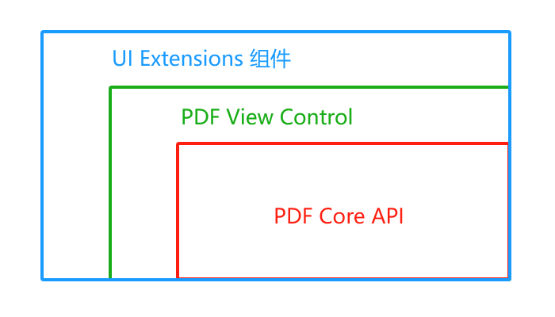

# 介绍

Foxit PDF SDK for Android致力于帮助开发人员快速将强大的Foxit
PDF技术集成到他们自己的移动端应用程序中。通过Foxit开发包，即使是对PDF了解有限的开发人员也可以在Android平台上用几
行代码快速构建一个专业的PDF阅读器。

## 为什么选择Foxit PDF SDK

Foxit：领先的PDF解决方案供应商，专注显示、编辑、创建、管理及安全。Foxit PDF SDK被众多知名应用采用，因其质量、性能和功能强大。

Android PDF SDK：快速阅读，优化操作。理由：

- 轻松集成：数行代码，无缝融入你的应用。
- 完美设计：简洁、友好，提供优质用户体验。
- 灵活定制：应用层用户界面源代码，功能与界面随你变。
- 性能稳健：OOM恢复机制，确保内存有限的设备稳定运行。
- 福昕引擎：基于全球知名企业信赖的福昕PDF引擎，快速解析和渲染，无惧环境挑战。
- 优质支持：福昕提供高效技术支持，助你解决开发难题，提升产品效能。我们拥有PDF行业的优秀工程师团队，持续进行版本更新，增添新功能，优化现有功能，提升用户体验。选择Foxit
  PDF SDK for Android，让你的应用更上一层楼。

## 包架构

### PDF Core API

PDF Core API是SDK的核心部分，建立在福昕强大的底层PDF技术上。它提供了PDF基础功能操作相关的函数，包含了PDF View控件和UI
Extensions组件中使用到的PDF核心处理功能，以确保应用程序达到高的性能和效率。该API可单独用于文档的渲染、分析、文本提取、文本搜索、表单填写、数字签名、压感笔迹(
PSI)、证书和密码加密、注释的创建和管理等等。

### PDF View Control

PDFView控件是一个工具类，根据开发人员的需求提供开发人员与渲染的PDF文档进行交互所需要的功能接口。以福昕享有盛誉且使用广泛的PDF渲染技术为核心，View
Control支持快速高质量的渲染、缩放、滚动和页面导览功能。该View控件继承于平台相关viewer的类，例如Android.View.ViewGroup,并且允许进行扩展来满足特定用户的需求。

### UI Extensions

UI Extensions组件是一个带内置UI的开源库，支持对内置的文本选择，标记注释、大纲导航、阅读书签、全文检索、填表、文本重排、文档附件、数字/手写签名、文档编辑和密码加密等功能进行自定义。UI
Extensions组件中的这些功能是通过使用PDF Core API和PDF View Control来实现的。开发人员可以利用这些已有的UI实现快速构建一个PDF阅读器，同时可以根据需要灵活自定义其UI界面。

[//]: # (## 主要功能)

[//]: # ()

[//]: # (Foxit PDF SDK for Android包括了一些主要的功能，用来帮助应用程序开发人员在快速实现他们所需要的功能的同时减少开发成本。)

[//]: # ()

[//]: # (| 功能                                                                      | 描述                                                                     |)

[//]: # (|-------------------------------------------------------------------------|------------------------------------------------------------------------|)

[//]: # (| [PDF Document]&#40;../guide/basic-features/pdf-document.html&#41;               | 打开和关闭文件，设置和获取metadata。                                                 |)

[//]: # (| [PDF Page]&#40;/RDK_Example/guide/basic-features/pdf-document.html&#41;         | 解析、渲染、阅读、编辑文档页面。                                                       |)

[//]: # (| [Render]&#40;/RDK_Example/guide/basic-features/pdf-document.html&#41;           | 平台图像设备在bitmap上创建图像渲染引擎。                                                |)

[//]: # (| [Reflow]&#40;/RDK_Example/guide/basic-features/pdf-document.html&#41;           | 重排页面内容。                                                                |)

[//]: # (| [Crop]&#40;/RDK_Example/guide/basic-features/pdf-document.html&#41;             | 裁剪PDF页面。                                                               |)

[//]: # (| [Text Select]&#40;/RDK_Example/guide/basic-features/pdf-document.html&#41;      | 文本选择。                                                                  |)

[//]: # (| [Text Search]&#40;/RDK_Example/guide/basic-features/pdf-document.html&#41;      | 文本搜索，并且支持全文索引搜索。                                                       |)

[//]: # (| [Outline]&#40;/RDK_Example/guide/basic-features/pdf-document.html&#41;          | 定位和链接到文档中的兴趣点。                                                         |)

[//]: # (| [Reading Bookmark]&#40;/RDK_Example/guide/basic-features/pdf-document.html&#41; | 标记文档中感兴趣的页面和段落位置。                                                      |)

[//]: # (| [Annotation]&#40;/RDK_Example/guide/basic-features/pdf-document.html&#41;       | 创建、编辑和移除annotations。                                                   |)

[//]: # (| [Layers]&#40;/RDK_Example/guide/basic-features/pdf-document.html&#41;           | 添加、编辑和移除PDF层内容。                                                        |)

[//]: # (| [Attachments]&#40;/RDK_Example/guide/basic-features/pdf-document.html&#41;      | 添加、编辑和移除文档级的附件。                                                        |)

[//]: # (| [Form]&#40;/RDK_Example/guide/basic-features/pdf-document.html&#41;             | 支持JavaScript填表，通过XFDF/FDF/XML文件导入和导出表单数据。支持创建文本域、复选框、单选按钮、组合框、列表框和签名域。 |)

[//]: # (| [XFA]&#40;/RDK_Example/guide/basic-features/pdf-document.html&#41;              | 支持静态和动态XFA。                                                            |)

[//]: # (| [Signature]&#40;/RDK_Example/guide/basic-features/pdf-document.html&#41;        | 签名PDF文档，验证签名，添加或删除签名域。添加和验证第三方数字签名.支持签名的长期验证&#40;LTV&#41;。                     |)

[//]: # (| [Fill]&#40;/RDK_Example/guide/basic-features/pdf-document.html&#41;             | 用文本和符号填写扁平化表单（即非交互式表单）                                                 |)

[//]: # (| [Security]&#40;/RDK_Example/guide/basic-features/pdf-document.html&#41;         | 密码和证书加密PDF文档。                                                          |)

[//]: # (| [Pan and Zoom]&#40;/RDK_Example/guide/basic-features/pdf-document.html&#41;     | 调整视图中的放大倍数和位置以匹配Pan&Zoom缩略视图当中的矩形区域。                                   |)

[//]: # (| [Print]&#40;/RDK_Example/guide/basic-features/pdf-document.html&#41;            | 打印PDF文档。                                                               |)

[//]: # (| [RMS]&#40;/RDK_Example/guide/basic-features/pdf-document.html&#41;              | 支持微软IRMv1和IRMv2标准的RMS解密。                                               |)

[//]: # (| [Comparison]&#40;/RDK_Example/guide/basic-features/pdf-document.html&#41;       | 对比两个PDF文档，并且标记文档之间的差异。                                                 |)

[//]: # (| [Scanning]&#40;/RDK_Example/guide/basic-features/pdf-document.html&#41;         | 扫描纸质文档，并将其转换为PDF文档。                                                    |)

[//]: # (| [Speak]&#40;/RDK_Example/guide/basic-features/pdf-document.html&#41;            | 支持阅读PDF文档中的文本。                                                         |)

[//]: # (| [Split Screen]&#40;/RDK_Example/guide/basic-features/pdf-document.html&#41;     | 支持分屏。                                                                  |)

[//]: # (| [Out of Memory]&#40;/RDK_Example/guide/basic-features/pdf-document.html&#41;    | 从内存不足中恢复运行。                                                            |)

