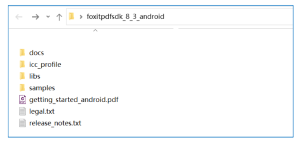
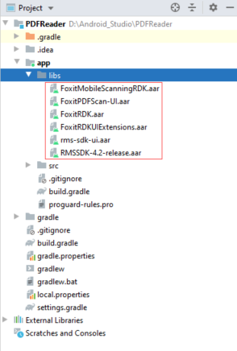

# 快速上手

## 下载开发包

::: tip
[福昕官网下载链接](https://developers.foxitsoftware.cn/version/pdfsdk-Android/)
:::

#### 系统要求

- Android 设备要求
    - Android 4.4(API 19)或更高版本
    - 32/64-bit ARM (armeabi-v7a/arm64-v8a) or 32/64-bit Intel x86 CPU
- Android Studio 3.2 or newer (支持AndroidX)

##### 包中Demos的运行环境

- Android Studio 4.1
- JDK 1.8
- Gradle Version 4.6
- Gradle Build Tool 3.2

::: warning
从7.2版本开始，Foxit PDF SDK for Android将只支持AndroidX，而不再支持Android support library。
:::

#### 包结构说明

从官网下载到开发包打开后如下：



| 文件名                         | 描述                                        |
|-----------------------------|-------------------------------------------|
| docs                        | API手册，开发文档和升级说明文档                         |
| icc_profile                 | 输出预览(output preview)功能所使用的默认icc profile文件 |
| libs                        | License文件，AAR，UI Extensions组件源代码          |
| samples                     | Android示例工程                               |
| getting_started_android.pdf | Foxit PDF SDK for Android快速入门             |
| legal.txt                   | 法律和版权信息                                   |
| release_notes.txt           | 发布信息                                      |

## 手动安装

将libs下的依赖包按需导入项目



#### libs目录说明

| 包名                         | 描述                                                                                                                                                   |
|----------------------------|------------------------------------------------------------------------------------------------------------------------------------------------------|
| FoxitRDK.aar               | Foxit PDF SDK for Android的所有Java APIs，以及".so"库。".so"库是SDK的核心包含了Foxit PDF SDK for Android的核心函数。它针对每种架构单独编译，当期支持armeabi-v7a, arm64-v8a, x86,和x86_64架构。 |
| uiextensions_src           | 一个开源库，包含了一些即用型的UI模块实现，可以帮助开发人员快速将功能齐全的PDF阅读器嵌入到他们的Android应用中。当然，开发人员也不是必须要使用默认的UI，可以通过"uiextensions_src"工程为特定的应用灵活自定义和设计UI。                          |
| FoxitRDKUIExtensions.aar   | 内置UI实现，以及UI所需要的资源文件，如图片，字符串、颜色值、布局文件以及其他Android UI资源。                                                                                                |
| FoxitMobileScanningRDK.aar | 提供扫描功能所需要的库。                                                                                                                                         |
| FoxitPDFScan-UI.aar        | 提供实现扫描功能所需UI的Android Activities。                                                                                                                     |
| RMSSDK-x.x-release.aar     | 微软权限管理系统的软件开发包。更多详细信息，[请参考](https://www.microsoft.com/en-ie/download/details.aspx?id=43673).                                                         |
| rms-sdk-ui.aar             | 提供实现RMS SDK功能所需UI的Android Activities。更多详细信息，[请参考](https://github.com/AzureAD/rms-sdk-ui-for-android).                                                |
| pdfscan                    | 一个开源库，包含了扫描功能相关的UI实现，可以帮助开发人员快速将扫描功能集成到他们的Android应用中，或者根据需要自定义扫描功能的UI。                                                                               |

::: warning
为了减小FoxitRDKUIExtensions.aar的文件大小，Foxit PDF SDK for
Android在uiextensions_src工程中使用shrink-code技术。如果您在编译Uiextensions_src工程时，不需使用
shrink-code，您可以在App下的build.gradle中通过设置"minifyEnabled"为"false"来进行禁用。关
于shrink-code，[请参考](https://developer.android.com/studio/build/shrink-code.html).
:::

### 项目配置

- **步骤1：** 将"libs"目录定义为 repository。在 app 下面的 build.gradle 文件中，配置如下的代码：

``` groovy
repositories {
    flatDir {
        dirs 'libs'
    }
}
```

- **步骤2：** 启用Multi-Dex。在app下面的build.gradle文件中，配置如下的代码：

``` groovy
android {
  defaultConfig {
      ...
      minSdkVersion 15
      targetSdkVersion 33
      multiDexEnabled true
  }
  ...
}

dependencies {
    implementation "androidx.multidex:multidex:2.0.1"
}
```

- **步骤3：** 在工程级build.gradle文件中，配置如下代码

``` groovy
allprojects{
  repositories{
    google()
    mavenCentral()
    maven {
      url 'https://pkgs.dev.azure.com/MicrosoftDeviceSDK/DuoSDK-Public/_packaging/Duo-SDK-Feed/maven/v1'
    }
    ...
  }
}
```

- **步骤4：** 将Foxit PDF SDK for Android作为工程的依赖项。在app下面的"build.gradle"文件中，添加"FoxitRDK.aar", "
  FoxitRDKUIExtensions.aar"以及相关支持的库到dependencies。为简单起见，如下所示更新dependencies：

``` groovy
dependencies {
    ...
    implementation 'androidx.appcompat:appcompat:1.6.1'
    implementation "androidx.multidex:multidex:2.0.1"
    //  UI Extensions 使用了material来封装UI，如果使用UI Extensions一定要添加
    implementation 'com.google.android.material:material:1.8.0'
    //  Foxit PDF Core API 及 PDF View Control
    implementation(name: 'FoxitRDK', ext: 'aar')
    //  UI Extensions组件
    implementation(name: 'FoxitRDKUIExtensions', ext: 'aar')
    //  (可选)如果您需要使用截图功能
    implementation 'com.edmodo:cropper:1.0.1'
    //  (可选)如果您需要打开RMS加密的PDF文档
    implementation(name: 'RMSSDK-4.2-release', ext: 'aar')
    implementation(name: 'rms-sdk-ui', ext: 'aar')
    implementation 'com.microsoft.identity.client:msal:3.0.+'
    //  (可选)如果您需要使用扫描功能
    implementation(name: 'FoxitPDFScan-UI', ext: 'aar')
    implementation(name: 'FoxitMobileScanningRDK', ext: 'aar')
    implementation 'com.nostra13.universalimageloader:universal-image-loader:1.9.5'
    //  (可选)如果您需要使用对比功能
    implementation "io.reactivex.rxjava2:rxjava:2.2.16"
    implementation 'io.reactivex.rxjava2:rxandroid:2.1.1'
    //  (可选)如果您需要使用签名功能
    implementation 'org.bouncycastle:bcpkix-jdk15on:1.60'
    implementation 'org.bouncycastle:bcprov-jdk15on:1.60'
    ...
}
```

app下完整build.gradle如下：

``` groovy
plugins {
    id 'com.android.application'
}

android {
    compileSdkVersion30
    buildToolsVersion"30.0.3"

    defaultConfig {
        applicationId"com.foxit.pdfreader"
        minSdkVersion 19
        targetSdkVersion  30
        versionCode 1
        versionName "1.0"
        testInstrumentationRunner"androidx.test.runner.AndroidJUnitRunner"multiDexEnabledtrue
    }
    buildTypes {
        release {
            minifyEnabled false
            proguardFiles getDefaultProguardFile('proguard-android.txt'), 'proguard-rules.pro'
        }
    }
    compileOptions {
        sourceCompatibility JavaVersion.VERSION_1_8
        targetCompatibility JavaVersion.VERSION_1_8
    }

}

repositories {
    flatDir {
        dirs 'libs'
    }
}

dependencies {
    implementation 'androidx.appcompat:appcompat:1.6.1'
    implementation "androidx.multidex:multidex:2.0.1"
    //  UI Extensions 使用了material来封装UI，如果使用UI Extensions一定要添加
    implementation 'com.google.android.material:material:1.8.0'
    //  Foxit PDF Core API 及 PDF View Control
    implementation(name: 'FoxitRDK', ext: 'aar')
    //  UI Extensions组件
    implementation(name: 'FoxitRDKUIExtensions', ext: 'aar')
    //  (可选)如果您需要使用截图功能
    implementation 'com.edmodo:cropper:1.0.1'
    //  (可选)如果您需要打开RMS加密的PDF文档
    implementation(name: 'RMSSDK-4.2-release', ext: 'aar')
    implementation(name: 'rms-sdk-ui', ext: 'aar')
    implementation 'com.microsoft.identity.client:msal:3.0.+'
    //  (可选)如果您需要使用扫描功能
    implementation(name: 'FoxitPDFScan-UI', ext: 'aar')
    implementation(name: 'FoxitMobileScanningRDK', ext: 'aar')
    implementation 'com.nostra13.universalimageloader:universal-image-loader:1.9.5'
    //  (可选)如果您需要使用对比功能
    implementation "io.reactivex.rxjava2:rxjava:2.2.16"
    implementation 'io.reactivex.rxjava2:rxandroid:2.1.1'
    //  (可选)如果您需要使用签名功能
    implementation 'org.bouncycastle:bcpkix-jdk15on:1.60'
    implementation 'org.bouncycastle:bcprov-jdk15on:1.60'
}
```

::: warning
Gradle版本的不同配置方式会有差异
:::

### 初始化

初始化Foxit PDF SDK for Android。在调用任何API之前，应用程序必须使用license初始化Foxit PDF SDK
forAndroid。Library.initialize(sn, key)函数用于SDK库的初始化。试用license文件在下载包的"libs"
文件夹下。当试用期结束后，您需要购买正式license以继续使用该SDK。下面是SDK库初始化的示例代码。在下一节中将介绍该代码在PDFReader工程中的位置。

```java
import com.foxit.sdk.common.Library;
import com.foxit.sdk.common.Constants;

int errorCode = Library.initialize(sn, key);
if (errorCode != Constants.e_ErrSuccess) {
  return
```

::: tip
sn的值在"rdk_sn.txt"中("SN="后面的字符串)

key的值在"rdk_key.txt"中("Sign="后面的字符串)。
:::
